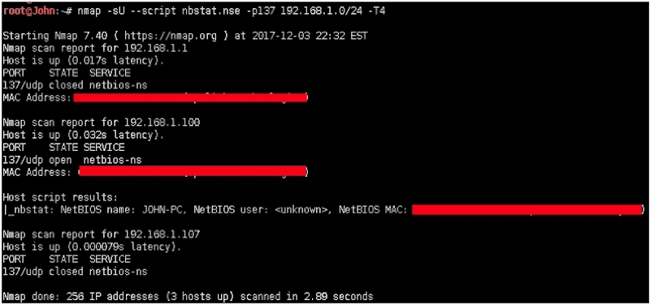
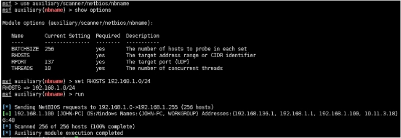
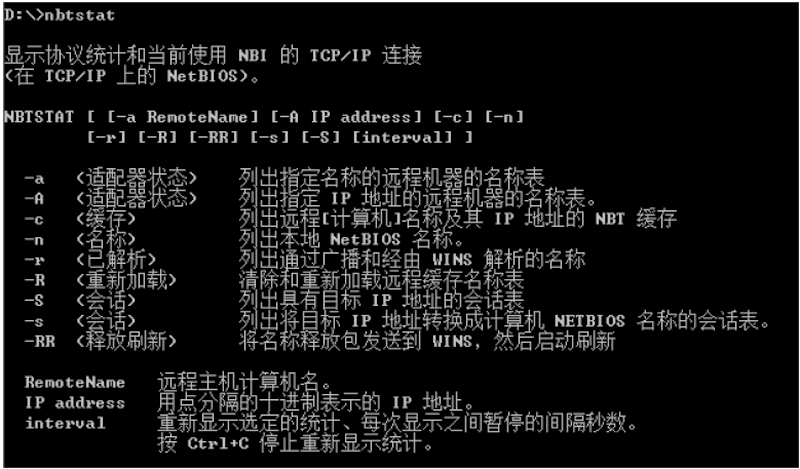
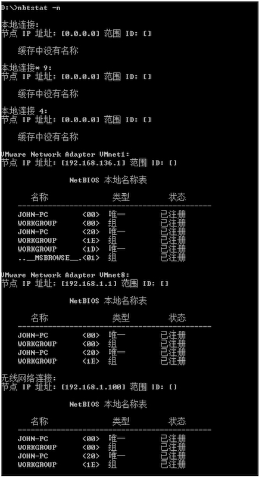
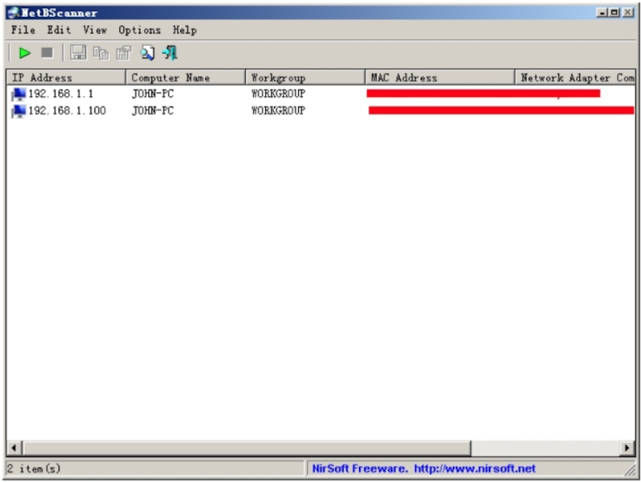

### netbios简介：
IBM公司开发，主要用于数十台计算机的小型局域网。该协议是一种在局域网上的程序可以使用的应用程序编程接口（API），为程序提供了请求低级服务的同一的命令集，作用是为了给局域网提供网络以及其他特殊功能。  

系统可以利用WINS服务、广播及Lmhost文件等多种模式将NetBIOS名-——特指基于NETBIOS协议获得计算机名称——解析为相应IP地址，实现信息通讯，所以在局域网内部使用NetBIOS协议可以方便地实现消息通信及资源的共享。

### nmap扫描：

```bash
root@John:~# nmap -sU --script nbstat.nse -p137 192.168.1.0/24 -T4
```  


### msf扫描：

```bash
msf > use auxiliary/scanner/netbios/nbname
```  


### nbtscan扫描：

项目地址：  
http://www.unixwiz.net/tools/nbtscan.html  
**Windows:**
```bash
D:\>nbtscan-1.0.35.exe -m 192.168.1.0/24
```  


```bash
D:\>nbtstat -n （推荐）
```  
  



### Linux：（推荐）
```bash
root@John:~/Desktop/nbtscan# tar -zxvf ./nbtscan-source-1.0.35.tgz（1.5.1版本在附录）
root@John:~/Desktop/nbtscan# make 
root@John:~/Desktop/nbtscan# nbtscan -r 192.168.1.0/24
```  


```bash
root@John:~/Desktop/nbtscan# nbtscan -v -s: 192.168.1.0/24
```  


### NetBScanner：
项目地址：  
https://www.nirsoft.net/utils/netbios_scanner.html  



### 附录：
nbtscan：  
链接：https://pan.baidu.com/s/1hs8ckmg  
密码：av40  

```bash
NBTscan version 1.5.1. Copyright (C) 1999-2003 Alla Bezroutchko. This is a free software and it comes with absolutely no warranty. You can use,distribute and modify it under terms of GNU GPL.

Usage:
nbtscan [-v] [-d] [-e] [-l] [-t timeout] [-b bandwidth] [-r] [-q] [-s separator] [-m retransmits] (-f filename)|(<scan_range>)
    -v verbose output. Print all names receivedfrom each host
    -d dump packets. Print whole packet contents.
    -e Format output in /etc/hosts format.
    -l Format output in lmhosts format.Cannot be used with -v, -s or -h options.
    -t timeout wait timeout milliseconds for response.Default 1000.
    -b bandwidth Output throttling. Slow down output so that it uses no more that bandwidth bps. Useful on slow links, so that ougoing queries don't get dropped.
    -r use local port 137 for scans. Win95 boxes respond to this only.You need to be root to use this option on Unix.
    -q Suppress banners and error messages,
    -s separator Script-friendly output. Don't print column and record headers, separate fields with separator.
    -h Print human-readable names for services. Can only be used with -v option.
    -m retransmits Number of retransmits. Default 0.
    -f filename Take IP addresses to scan from file filename.
    -f - makes nbtscan take IP addresses from stdin.
    <scan_range> what to scan. Can either be single IP 
        like 192.168.1.1 or
        range of addresses in one of two forms:
        xxx.xxx.xxx.xxx/xx or xxx.xxx.xxx.xxx-xxx.

Examples:
    nbtscan -r 192.168.1.0/24
        Scans the whole C-class network.
    nbtscan 192.168.1.25-137
        Scans a range from 192.168.1.25 to 192.168.1.137
    nbtscan -v -s : 192.168.1.0/24
        Scans C-class network. Prints results in script-friendly
        format using colon as field separator.  
        Produces output like that:
        192.168.0.1:NT_SERVER:00U
        192.168.0.1:MY_DOMAIN:00G
        192.168.0.1:ADMINISTRATOR:03U
        192.168.0.2:OTHER_BOX:00U
        ...
    nbtscan -f iplist
        Scans IP addresses specified in file iplist.
```
NBTscan version 1.5.1:  
项目地址：  
https://github.com/scallywag/nbtscan

>   Micropoor
