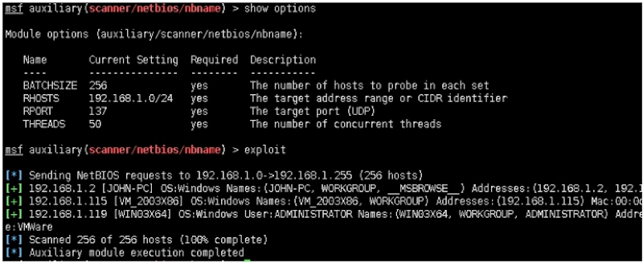
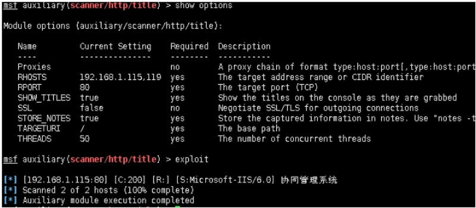
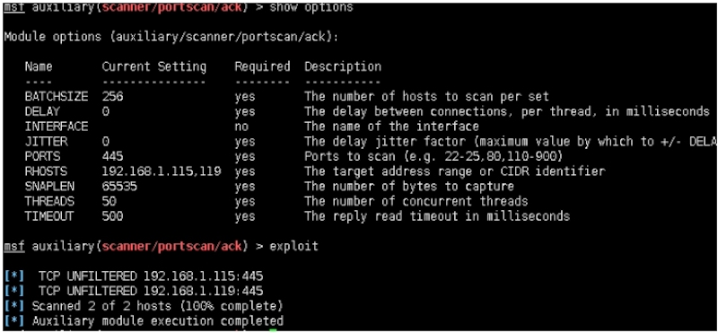
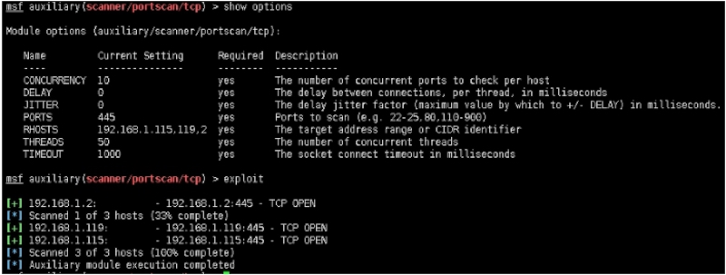

# 专注APT攻击与防御
https://micropoor.blogspot.com/

**注：**请多喝点热水或者凉白开，可预防**肾结石，通风**等。
痛风可伴发肥胖症、高血压病、糖尿病、脂代谢紊乱等多种代谢性疾病。

**攻击机：** 
192.168.1.5 Debian
**靶机：** 
192.168.1.2 Windows 7
192.168.1.115 Windows 2003 
192.168.1.119 Windows 2003

**第一季主要介绍scanner下的五个模块，辅助发现内网存活主机，分别为：**

* auxiliary/scanner/discovery/arp_sweep 
* auxiliary/scanner/discovery/udp_sweep
* auxiliary/scanner/ftp/ftp_version 
* auxiliary/scanner/http/http_version
* auxiliary/scanner/smb/smb_version

**第二季主要介绍scanner下的五个模块，辅助发现内网存活主机，分别为：**

* auxiliary/scanner/ssh/ssh_version 
* auxiliary/scanner/telnet/telnet_version
* auxiliary/scanner/discovery/udp_probe 
* auxiliary/scanner/dns/dns_amp
* auxiliary/scanner/mysql/mysql_version

**第三季主要介绍scanner下的五个模块，辅助发现内网存活主机，分别为：**

* auxiliary/scanner/netbios/nbname 
* auxiliary/scanner/http/title
* auxiliary/scanner/db2/db2_version 
* auxiliary/scanner/portscan/ack
* auxiliary/scanner/portscan/tcp

**十一：基于auxiliary/scanner/netbios/nbname发现内网存活主机**
```bash
msf auxiliary(scanner/netbios/nbname) > show options 

Module options (auxiliary/scanner/netbios/nbname): 

Name Current Setting Required Description
‐‐‐‐ ‐‐‐‐‐‐‐‐‐‐‐‐‐‐‐ ‐‐‐‐‐‐‐‐ ‐‐‐‐‐‐‐‐‐‐‐
BATCHSIZE 256 yes The number of hosts to probe in each set
RHOSTS 192.168.1.0/24 yes The target address range or CIDR identifier
RPORT 137 yes The target port (UDP)
THREADS 50 yes The number of concurrent threads 

msf auxiliary(scanner/netbios/nbname) > exploit 

[*] Sending NetBIOS requests to 192.168.1.0‐>192.168.1.255 (256 hosts)
[+] 192.168.1.2 [JOHN‐PC] OS:Windows Names:(JOHN‐PC, WORKGROUP, __MSBROWSE__) Addresses:(192.168.1.2, 192.168.163.1, 192.168.32.1)Mac:4c:cc:6a:e3:51:27
[+] 192.168.1.115 [VM_2003X86] OS:Windows Names:(VM_2003X86,WORKGROUP) Addresses:(192.168.1.115) Mac:00:0c:29:af:ce:cc Virtual Machine:VMWare
[+] 192.168.1.119 [WIN03X64] OS:Windows User:ADMINISTRATOR Names:(WIN03X64, WORKGROUP, ADMINISTRATOR) Addresses:(192.168.1.119)Mac:00:0c:29:85:d6:7d Virtual Machine:VMWare
[*] Scanned 256 of 256 hosts (100% complete)
[*] Auxiliary module execution completed
```


**十二：基于auxiliary/scanner/http/title发现内网存活主机**

```bash
msf auxiliary(scanner/http/title) > show options 

Module options (auxiliary/scanner/http/title): 

Name Current Setting Required Description
‐‐‐‐ ‐‐‐‐‐‐‐‐‐‐‐‐‐‐‐ ‐‐‐‐‐‐‐‐ ‐‐‐‐‐‐‐‐‐‐‐
Proxies no A proxy chain of format type:host:port[,type:host:port] [...]
RHOSTS 192.168.1.115,119 yes The target address range or CIDR identifier
RPORT 80 yes The target port (TCP)
SHOW_TITLES true yes Show the titles on the console as they are grabbed
SSL false no Negotiate SSL/TLS for outgoing connections
STORE_NOTES true yes Store the captured information in notes. Use "no tes‐t http.title" to view
TARGETURI / yes The base path
THREADS 50 yes The number of concurrent threads 

msf auxiliary(scanner/http/title) > exploit 

[*] [192.168.1.115:80] [C:200] [R:] [S:Microsoft‐IIS/6.0] 协同管理系统
[*] Scanned 2 of 2 hosts (100% complete)
[*] Auxiliary module execution completed
```


**十三：基于auxiliary/scanner/db2/db2_version发现db2服务**
```bash
msf auxiliary(scanner/http/title) > use auxiliary/scanner/db2/db2_version
msf auxiliary(scanner/db2/db2_version) > show options 

Module options (auxiliary/scanner/db2/db2_version): 

Name Current Setting Required Description
‐‐‐‐ ‐‐‐‐‐‐‐‐‐‐‐‐‐‐‐ ‐‐‐‐‐‐‐‐ ‐‐‐‐‐‐‐‐‐‐‐
DATABASE toolsdb yes The name of the target database
RHOSTS 192.168.1.0/24 yes The target address range or CIDR identifier
RPORT 50000 yes The target port (TCP)
THREADS 50 yes The number of concurrent threads
TIMEOUT 5 yes Timeout for the DB2 probe 

msf auxiliary(scanner/db2/db2_version) > exploit
```


**十四：基于auxiliary/scanner/portscan/ack发现内网存活主机**
```bash
msf auxiliary(scanner/portscan/ack) > show options 

Module options (auxiliary/scanner/portscan/ack): 

Name Current Setting Required Description
‐‐‐‐ ‐‐‐‐‐‐‐‐‐‐‐‐‐‐‐ ‐‐‐‐‐‐‐‐ ‐‐‐‐‐‐‐‐‐‐‐
BATCHSIZE 256 yes The number of hosts to scan per set
DELAY 0 yes The delay between connections, per thread, in milliseconds
INTERFACE no The name of the interface
JITTER 0 yes The delay jitter factor (maximum value by which to +/‐ DELAY) in milliseconds.
PORTS 445 yes Ports to scan (e.g. 22‐25,80,110‐900)
RHOSTS 192.168.1.115,119 yes The target address range or CIDR identifier
SNAPLEN 65535 yes The number of bytes to capture
THREADS 50 yes The number of concurrent threads
TIMEOUT 500 yes The reply read timeout in milliseconds 

msf auxiliary(scanner/portscan/ack) > exploit 

[*] TCP UNFILTERED 192.168.1.115:445
[*] TCP UNFILTERED 192.168.1.119:445
[*] Scanned 2 of 2 hosts (100% complete)
[*] Auxiliary module execution completed
```


**十五：基于auxiliary/scanner/portscan/tcp发现内网存活主机**
```bash
msf auxiliary(scanner/portscan/tcp) > show options 

Module options (auxiliary/scanner/portscan/tcp): 

Name Current Setting Required Description
‐‐‐‐ ‐‐‐‐‐‐‐‐‐‐‐‐‐‐‐ ‐‐‐‐‐‐‐‐ ‐‐‐‐‐‐‐‐‐‐‐
CONCURRENCY 10 yes The number of concurrent ports to check per host
DELAY 0 yes The delay between connections, per thread, in milliseconds
JITTER 0 yes The delay jitter factor (maximum value by which to +/‐ DELAY) in milliseconds.
PORTS 445 yes Ports to scan (e.g. 22‐25,80,110‐900)
RHOSTS 192.168.1.115,119,2 yes The target address range or CIDR identifier
THREADS 50 yes The number of concurrent threads
TIMEOUT 1000 yes The socket connect timeout in milliseconds

msf auxiliary(scanner/portscan/tcp) > exploit 

[+] 192.168.1.2: ‐ 192.168.1.2:445 ‐ TCP OPEN
[*] Scanned 1 of 3 hosts (33% complete)
[+] 192.168.1.119: ‐ 192.168.1.119:445 ‐ TCP OPEN
[+] 192.168.1.115: ‐ 192.168.1.115:445 ‐ TCP OPEN
[*] Scanned 3 of 3 hosts (100% complete)
[*] Auxiliary module execution completed
```


>   Micropoor
