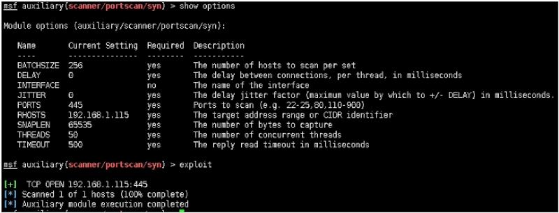
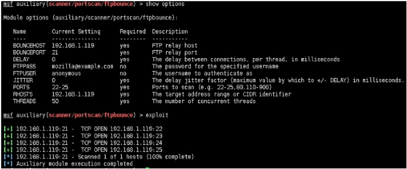
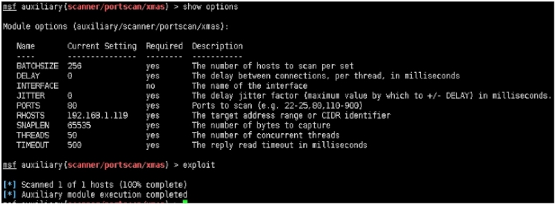
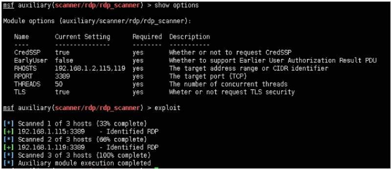
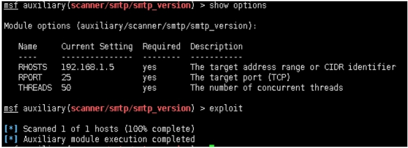

**注：**请多喝点热水或者凉白开，可预防**肾结石，通风**等。
痛风可伴发肥胖症、高血压病、糖尿病、脂代谢紊乱等多种代谢性疾病。

**攻击机：** 
192.168.1.5 Debian

**靶机：**
192.168.1.2 Windows 7  
192.168.1.115 Windows 2003  
192.168.1.119 Windows 2003

**第一季主要介绍scanner下的五个模块，辅助发现内网存活主机，分别为：**

* auxiliary/scanner/discovery/arp_sweep 
* auxiliary/scanner/discovery/udp_sweep
* auxiliary/scanner/ftp/ftp_version 
* auxiliary/scanner/http/http_version
* auxiliary/scanner/smb/smb_version

**第二季主要介绍scanner下的五个模块，辅助发现内网存活主机，分别为：**

* auxiliary/scanner/ssh/ssh_version 
* auxiliary/scanner/telnet/telnet_version
* auxiliary/scanner/discovery/udp_probe
* auxiliary/scanner/dns/dns_amp
* auxiliary/scanner/mysql/mysql_version

**第三季主要介绍scanner下的五个模块，辅助发现内网存活主机，分别为：**

* auxiliary/scanner/netbios/nbname 
* auxiliary/scanner/http/title
* auxiliary/scanner/db2/db2_version 
* auxiliary/scanner/portscan/ack
* auxiliary/scanner/portscan/tcp

**第四季主要介绍scanner下的五个模块，辅助发现内网存活主机，分别为：**

* auxiliary/scanner/portscan/syn 
* auxiliary/scanner/portscan/ftpbounce
* auxiliary/scanner/portscan/xmas 
* auxiliary/scanner/rdp/rdp_scanner
* auxiliary/scanner/smtp/smtp_version

### 十六：基于auxiliary/scanner/portscan/syn发现内网存活主机

```bash
msf auxiliary(scanner/portscan/syn) > show options 

Module options (auxiliary/scanner/portscan/syn): 

Name Current Setting Required Description
‐‐‐‐ ‐‐‐‐‐‐‐‐‐‐‐‐‐‐‐ ‐‐‐‐‐‐‐‐ ‐‐‐‐‐‐‐‐‐‐‐
BATCHSIZE 256 yes The number of hosts to scan per set
DELAY 0 yes The delay between connections, per thread, in millisecond s
INTERFACE no The name of the interface
JITTER 0 yes The delay jitter factor (maximum value by which to +/‐ DELAY) in milliseconds.
PORTS 445 yes Ports to scan (e.g. 22‐25,80,110‐900)
RHOSTS 192.168.1.115 yes The target address range or CIDR identifier
SNAPLEN 65535 yes The number of bytes to capture
THREADS 50 yes The number of concurrent threads
TIMEOUT 500 yes The reply read timeout in milliseconds 

msf auxiliary(scanner/portscan/syn) > exploit 

[+] TCP OPEN 192.168.1.115:445

[*] Scanned 1 of 1 hosts (100% complete)
[*] Auxiliary module execution completed
```


### 十七：基于auxiliary/scanner/portscan/ftpbounce发现内网存活主机
```bash
msf auxiliary(scanner/portscan/ftpbounce) > show options 

Module options (auxiliary/scanner/portscan/ftpbounce): 

Name Current Setting Required Description
‐‐‐‐ ‐‐‐‐‐‐‐‐‐‐‐‐‐‐‐ ‐‐‐‐‐‐‐‐ ‐‐‐‐‐‐‐‐‐‐‐
BOUNCEHOST 192.168.1.119 yes FTP relay host
BOUNCEPORT 21 yes FTP relay port
DELAY 0 yes The delay between connections, per thread, in millisecond s
FTPPASS mozilla@example.com no The password for the specified usernam e
FTPUSER anonymous no The username to authenticate as
JITTER 0 yes The delay jitter factor (maximum value by which to +/‐ DELAY) in milliseconds.
PORTS 22‐25 yes Ports to scan (e.g. 22‐25,80,110‐900)
RHOSTS 192.168.1.119 yes The target address range or CIDR identifier
THREADS 50 yes The number of concurrent threads 

msf auxiliary(scanner/portscan/ftpbounce) > exploit 

[+] 192.168.1.119:21 ‐ TCP OPEN 192.168.1.119:22
[+] 192.168.1.119:21 ‐ TCP OPEN 192.168.1.119:23
[+] 192.168.1.119:21 ‐ TCP OPEN 192.168.1.119:24
[+] 192.168.1.119:21 ‐ TCP OPEN 192.168.1.119:25
[*] 192.168.1.119:21 ‐ Scanned 1 of 1 hosts (100% complete)
[*] Auxiliary module execution completed
```




### 十八：基于auxiliary/scanner/portscan/xmas发现内网存活主机
```bash
msf auxiliary(scanner/portscan/xmas) > show options 

Module options (auxiliary/scanner/portscan/xmas): 

Name Current Setting Required Description
‐‐‐‐ ‐‐‐‐‐‐‐‐‐‐‐‐‐‐‐ ‐‐‐‐‐‐‐‐ ‐‐‐‐‐‐‐‐‐‐‐
BATCHSIZE 256 yes The number of hosts to scan per set
DELAY 0 yes The delay between connections, per thread, in millisecond s
INTERFACE no The name of the interface
JITTER 0 yes The delay jitter factor (maximum value by which to +/‐ DELAY) in milliseconds.
PORTS 80 yes Ports to scan (e.g. 22‐25,80,110‐900)
RHOSTS 192.168.1.119 yes The target address range or CIDR identifier
SNAPLEN 65535 yes The number of bytes to capture
THREADS 50 yes The number of concurrent threads
TIMEOUT 500 yes The reply read timeout in milliseconds 

msf auxiliary(scanner/portscan/xmas) > exploit
```


### 十九：基于auxiliary/scanner/rdp/rdp_scanner发现内网存活主机
```bash
msf auxiliary(scanner/rdp/rdp_scanner) > show options 

Module options (auxiliary/scanner/rdp/rdp_scanner): 

Name Current Setting Required Description
‐‐‐‐ ‐‐‐‐‐‐‐‐‐‐‐‐‐‐‐ ‐‐‐‐‐‐‐‐ ‐‐‐‐‐‐‐‐‐‐‐
CredSSP true yes Whether or not to request CredSSP
EarlyUser false yes Whether to support Earlier User Authorization Result PDU
RHOSTS 192.168.1.2,115,119 yes The target address range or CIDR identifier
RPORT 3389 yes The target port (TCP)
THREADS 50 yes The number of concurrent threads
TLS true yes Wheter or not request TLS security 

msf auxiliary(scanner/rdp/rdp_scanner) > exploit 

[*] Scanned 1 of 3 hosts (33% complete)
[+] 192.168.1.115:3389 ‐ Identified RDP
[*] Scanned 2 of 3 hosts (66% complete)
[+] 192.168.1.119:3389 ‐ Identified RDP
[*] Scanned 3 of 3 hosts (100% complete)
[*] Auxiliary module execution completed
```



### 二十：基于auxiliary/scanner/smtp/smtp_version发现内网存活主机
```bash
msf auxiliary(scanner/smtp/smtp_version) > show options 

Module options (auxiliary/scanner/smtp/smtp_version): 

Name Current Setting Required Description
‐‐‐‐ ‐‐‐‐‐‐‐‐‐‐‐‐‐‐‐ ‐‐‐‐‐‐‐‐ ‐‐‐‐‐‐‐‐‐‐‐
RHOSTS 192.168.1.5 yes The target address range or CIDR identifier
RPORT 25 yes The target port (TCP)
THREADS 50 yes The number of concurrent threads

msf auxiliary(scanner/smtp/smtp_version) > exploit
```  


>   Micropoor
