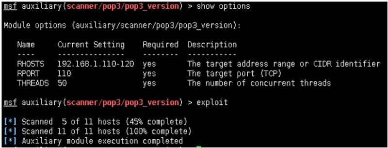
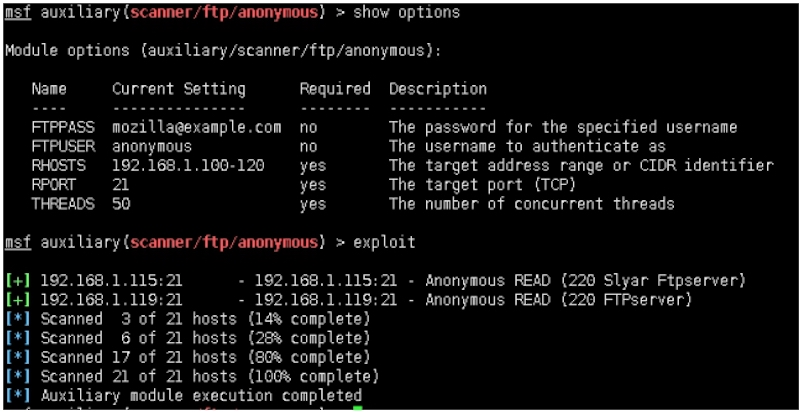
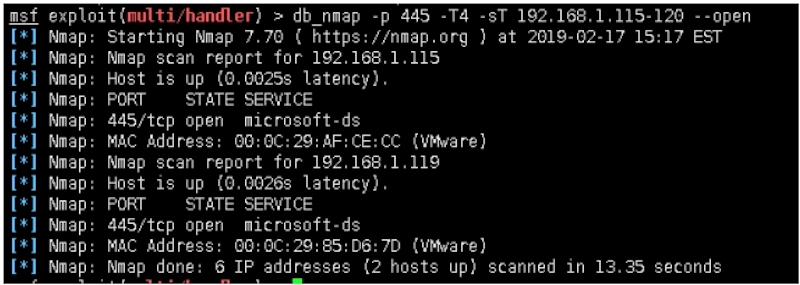
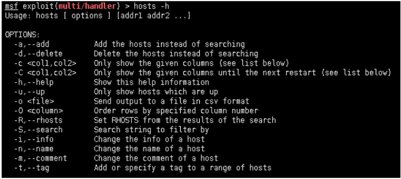
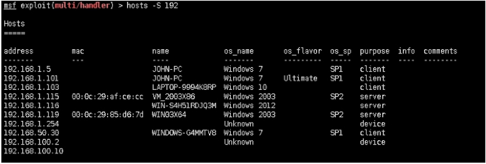

# 专注APT攻击与防御
https://micropoor.blogspot.com/

**注：**请多喝点热水或者凉白开，可预防**肾结石，通风**等。
痛风可伴发肥胖症、高血压病、糖尿病、脂代谢紊乱等多种代谢性疾病。

**攻击机：** 
192.168.1.102 Debian
**靶机：** 
192.168.1.2 Windows 7
192.168.1.115 Windows 2003 
192.168.1.119 Windows 2003

**第一季主要介绍scanner下的五个模块，辅助发现内网存活主机，分别为：**
* auxiliary/scanner/discovery/arp_sweep 
* auxiliary/scanner/discovery/udp_sweep
* auxiliary/scanner/ftp/ftp_version 
* auxiliary/scanner/http/http_version
* auxiliary/scanner/smb/smb_version

**第二季主要介绍scanner下的五个模块，辅助发现内网存活主机，分别为：**

* auxiliary/scanner/ssh/ssh_version 
* auxiliary/scanner/telnet/telnet_version
* auxiliary/scanner/discovery/udp_probe 
* auxiliary/scanner/dns/dns_amp
* auxiliary/scanner/mysql/mysql_version

**第三季主要介绍scanner下的五个模块，辅助发现内网存活主机，分别为：**

* auxiliary/scanner/netbios/nbname 
* auxiliary/scanner/http/title
* auxiliary/scanner/db2/db2_version 
* auxiliary/scanner/portscan/ack
* auxiliary/scanner/portscan/tcp

**第四季主要介绍scanner下的五个模块，辅助发现内网存活主机，分别为：**

* auxiliary/scanner/portscan/syn 
* auxiliary/scanner/portscan/ftpbounce
* auxiliary/scanner/portscan/xmas 
* auxiliary/scanner/rdp/rdp_scanner
* auxiliary/scanner/smtp/smtp_version

**第五季主要介绍scanner下的三个模块，以及db_nmap辅助发现内网存活主机，分别为：**

* auxiliary/scanner/pop3/pop3_version
* auxiliary/scanner/postgres/postgres_version 
* auxiliary/scanner/ftp/anonymous
* db_nmap

**二十一：基于auxiliary/scanner/pop3/pop3_version发现内网存活主机**
```bash
msf auxiliary(scanner/pop3/pop3_version) > show options 

Module options (auxiliary/scanner/pop3/pop3_version): 

Name Current Setting Required Description
‐‐‐‐ ‐‐‐‐‐‐‐‐‐‐‐‐‐‐‐ ‐‐‐‐‐‐‐‐ ‐‐‐‐‐‐‐‐‐‐‐
RHOSTS 192.168.1.110‐120 yes The target address range or CIDR identifier
RPORT 110 yes The target port (TCP)
THREADS 50 yes The number of concurrent threads 

msf auxiliary(scanner/pop3/pop3_version) > exploit 

[*] Scanned 5 of 11 hosts (45% complete)
[*] Scanned 11 of 11 hosts (100% complete)
[*] Auxiliary module execution completed
```


**二十二：基于auxiliary/scanner/postgres/postgres_version发现内网存活主机**
```bash
msf auxiliary(scanner/postgres/postgres_version) > show options 

Module options (auxiliary/scanner/postgres/postgres_version): 

Name Current Setting Required Description
‐‐‐‐ ‐‐‐‐‐‐‐‐‐‐‐‐‐‐‐ ‐‐‐‐‐‐‐‐ ‐‐‐‐‐‐‐‐‐‐‐
DATABASE template1 yes The database to authenticate against
PASSWORD msf no The password for the specified username. Leave blank for a random password.
RHOSTS 127.0.0.1 yes The target address range or CIDR identifier
RPORT 5432 yes The target port
THREADS 50 yes The number of concurrent threads
USERNAME msf yes The username to authenticate as
VERBOSE false no Enable verbose output 

msf auxiliary(scanner/postgres/postgres_version) > exploit 

[*] 127.0.0.1:5432 Postgres ‐ Version PostgreSQL 9.6.6 on x86_64‐pc‐li
nux‐gnu, compiled by gcc (Debian 4.9.2‐10) 4.9.2, 64‐bit (Post‐Auth)
[*] Scanned 1 of 1 hosts (100% complete)
[*] Auxiliary module execution completed
```


**二十三：基于auxiliary/scanner/ftp/anonymous发现内网存活主机**
```bash
msf auxiliary(scanner/ftp/anonymous) > show options 

Module options (auxiliary/scanner/ftp/anonymous): 

Name Current Setting Required Description
‐‐‐‐ ‐‐‐‐‐‐‐‐‐‐‐‐‐‐‐ ‐‐‐‐‐‐‐‐ ‐‐‐‐‐‐‐‐‐‐‐
FTPPASS mozilla@example.com no The password for the specified username
FTPUSER anonymous no The username to authenticate as
RHOSTS 192.168.1.100‐120 yes The target address range or CIDR identifier
RPORT 21 yes The target port (TCP)
THREADS 50 yes The number of concurrent threads 

msf auxiliary(scanner/ftp/anonymous) > exploit 

[+] 192.168.1.115:21 ‐ 192.168.1.115:21 ‐ Anonymous READ (220 Slyar Ftpserver)
[+] 192.168.1.119:21 ‐ 192.168.1.119:21 ‐ Anonymous READ (220 FTPserver)
[*] Scanned 3 of 21 hosts (14% complete)
[*] Scanned 6 of 21 hosts (28% complete)
[*] Scanned 17 of 21 hosts (80% complete)
[*] Scanned 21 of 21 hosts (100% complete)
[*] Auxiliary module execution completed
```


**二十四：基于db_nmap发现内网存活主机**

MSF内置强大的端口扫描工具Nmap，为了更好的区别，内置命令为：db_nmap，并且会自动存储nmap扫描结果到数据库中，方便快速查询已知存活主机，以及更快捷的进行团队协同作战，使用方法与nmap一致。也是在实战中最常用到的发现内网存活主机方式之一。

例：
```bash
msf exploit(multi/handler) > db_nmap ‐p 445 ‐T4 ‐sT 192.168.1.115‐120
‐‐open
[*] Nmap: Starting Nmap 7.70 ( https://nmap.org ) at 2019‐02‐17 15:17 EST
[*] Nmap: Nmap scan report for 192.168.1.115
[*] Nmap: Host is up (0.0025s latency).
[*] Nmap: PORT STATE SERVICE
[*] Nmap: 445/tcp open microsoft‐ds
[*] Nmap: MAC Address: 00:0C:29:AF:CE:CC (VMware)
[*] Nmap: Nmap scan report for 192.168.1.119
[*] Nmap: Host is up (0.0026s latency).
[*] Nmap: PORT STATE SERVICE
[*] Nmap: 445/tcp open microsoft‐ds
[*] Nmap: MAC Address: 00:0C:29:85:D6:7D (VMware)
[*] Nmap: Nmap done: 6 IP addresses (2 hosts up) scanned in 13.35 seconds
```


命令hosts查看数据库中已发现的内网存活主机
```bash
msf exploit(multi/handler) > hosts 

Hosts
===== 

address mac name os_name os_flavor os_sp purpose info comments
‐‐‐‐‐‐‐ ‐‐‐ ‐‐‐‐ ‐‐‐‐‐‐‐ ‐‐‐‐‐‐‐‐‐ ‐‐‐‐‐ ‐‐‐‐‐‐‐ ‐‐‐‐ ‐‐‐‐‐‐‐‐
1.34.37.188 firewall
10.0.0.2 00:24:1d:dc:3b:16
10.0.0.3 00:e0:81:bf:b9:7b
10.0.0.4 00:30:6e:ca:10:b8
10.0.0.5 9c:8e:99:c4:63:74 2013XXXXX Windows 2008 SP1 client
...
10.0.0.242 00:13:57:01:d4:71
10.0.0.243 00:13:57:01:d4:73
....
10.162.110.30 firewall
59.125.110.178 firewall
127.0.0.1 Unknown device
172.16.204.8 WIN‐6FEAACQJ691 Windows 2012 server
172.16.204.9 WIN‐6FEAACQJ691 Windows 2012 server
172.16.204.21 IDS Windows 2003 SP2 server
192.168.1.5 JOHN‐PC Windows 7 SP1 client
192.168.1.101 JOHN‐PC Windows 7 Ultimate SP1 client
192.168.1.103 LAPTOP‐9994K8RP Windows 10 client
192.168.1.115 00:0c:29:af:ce:cc VM_2003X86 Windows 2003 SP2 server
192.168.1.116 WIN‐S4H51RDJQ3M Windows 2012 server
192.168.1.119 00:0c:29:85:d6:7d WIN03X64 Windows 2003 SP2 server
192.168.1.254 Unknown device
192.168.50.30 WINDOWS‐G4MMTV8 Windows 7 SP1 client
192.168.100.2 Unknown device
192.168.100.10
```


同样hosts命令也支持数据库中查询与搜索，方便快速对应目标存活主机。
```bash
msf exploit(multi/handler) > hosts ‐h
Usage: hosts [ options ] [addr1 addr2 ...] 

OPTIONS:
‐a,‐‐add Add the hosts instead of searching
‐d,‐‐delete Delete the hosts instead of searching
‐c <col1,col2> Only show the given columns (see list below)
‐C <col1,col2> Only show the given columns until the next restart (see list below)
‐h,‐‐help Show this help information
‐u,‐‐up Only show hosts which are up
‐o <file> Send output to a file in csv format
‐O <column> Order rows by specified column number
‐R,‐‐rhosts Set RHOSTS from the results of the search
‐S,‐‐search Search string to filter by
‐i,‐‐info Change the info of a host
‐n,‐‐name Change the name of a host
‐m,‐‐comment Change the comment of a host
‐t,‐‐tag Add or specify a tag to a range of hosts
```


```bash
msf exploit(multi/handler) > hosts ‐S 192 

Hosts
===== 

address mac name os_name os_flavor os_sp purpose info comments
‐‐‐‐‐‐‐ ‐‐‐ ‐‐‐‐ ‐‐‐‐‐‐‐ ‐‐‐‐‐‐‐‐‐ ‐‐‐‐‐ ‐‐‐‐‐‐‐ ‐‐‐‐ ‐‐‐‐‐‐‐‐
192.168.1.5 JOHN‐PC Windows 7 SP1 client
192.168.1.101 JOHN‐PC Windows 7 Ultimate SP1 client
192.168.1.103 LAPTOP‐9994K8RP Windows 10 client
192.168.1.115 00:0c:29:af:ce:cc VM_2003X86 Windows 2003 SP2 server
192.168.1.116 WIN‐S4H51RDJQ3M Windows 2012 server
192.168.1.119 00:0c:29:85:d6:7d WIN03X64 Windows 2003 SP2 server
192.168.1.254 Unknown device
192.168.50.30 WINDOWS‐G4MMTV8 Windows 7 SP1 client
192.168.100.2 Unknown device
192.168.100.10
```


>   Micropoor
