许多教程都会讲解 msf 分别在 windows，linux 以及 Mac 上的安装，而在实际的项目中，或者实战中，居多以 vps 上做跳板渗透，而vps 又以 linux 居多。故本章直接以 linux 为安装背景。

### vps背景如下：
```bash
root@john:~# uname -a
Linux john 3.16.0-7-amd64 #1 SMP Debian 3.16.59-1 (2018-10-03) x86_64 GNU/Linux

root@john:~# lsb_release -a 
No LSB modules are available. 
Distributor ID: Debian
Description: Debian GNU/Linux 8.11 (jessie)
Release: 8.11 Codename: jessie

root@john:~# cat /proc/version
Linux version 3.16.0-7-amd64 (debian-kernel@lists.debian.org) (gcc version 4.9.2 (Debian 4.9.2-10+deb8u1) ) #1 SMP Debian 3.16.59-1 (2018-10-03)
```
以Debian为载体，更能快速的安装与配置msf。

### 安装：

**配置源**
```bash
root@john:~# nano /etc/apt/sources.list
root@john:~# cat /etc/apt/sources.list 
#
# deb cdrom:[Debian GNU/Linux 8.11.0 _Jessie_ - Official amd64 NETINST Binary-1 20180623-13:06]/ jessie main

#deb cdrom:[Debian GNU/Linux 8.11.0 _Jessie_ - Official amd64 NETINST Binary-1 20180623-13:06]/ jessie main

deb http://http.us.debian.org/debian/ jessie main 
deb-src http://http.us.debian.org/debian/ jessie main
deb http://security.debian.org/ jessie/updates main 
deb-src http://security.debian.org/ jessie/updates main

# jessie-updates, previously known as 'volatile'
deb http://http.us.debian.org/debian/ jessie-updates main 
deb-src http://http.us.debian.org/debian/ jessie-updates main 
#deb http://http.kali.org/kali kali-rolling main non-free contrib
#deb-src http://http.kali.org/kali kali-rolling main non-free contrib 
deb http://http.kali.org/kali kali-rolling main non-free contrib
#deb http://http.kali.org/kali kali-rolling main non-free contrib
```
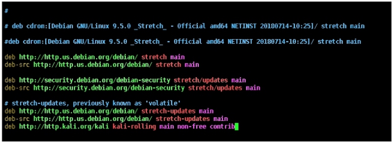

**更新源：**
```bash
root@john:~# apt-get update&&apt-get upgrade
```

更新后故可apt 安装即可，方便快捷。  
```bash
root@john:~# apt-get install metasploit-framework
```  
如安装sqlmap等。安装metasploit-framework，  
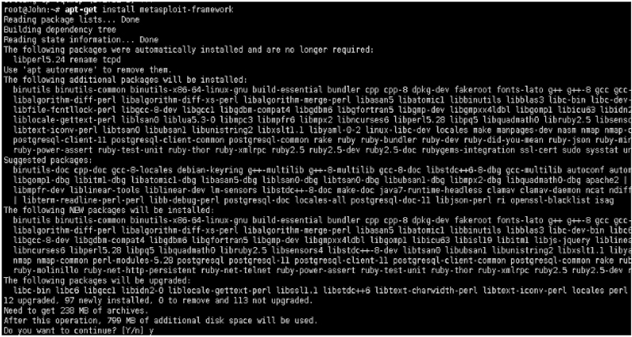

以此种方式安装，也无需在配置psql。可快速部署解决项目。  
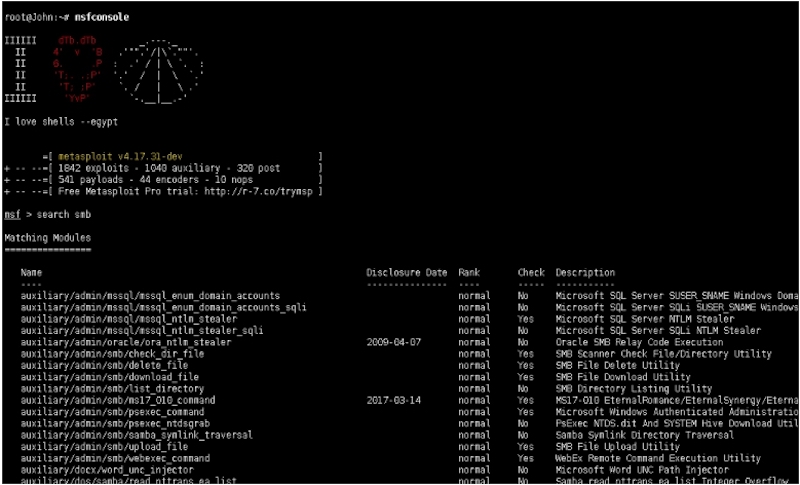

**sqlmap**  
 
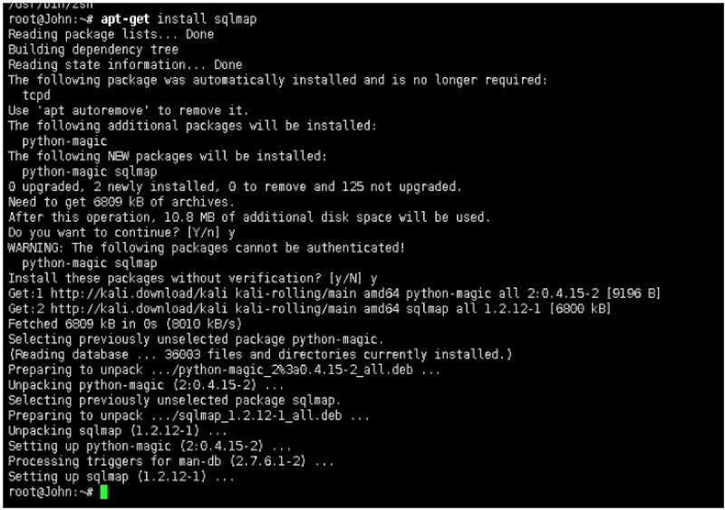

在虚拟机，多数存在几点问题  
1. 配置后，ssh无法连接  
2. 关于vmtools的问题  
3. 虚拟机的vpn问题  
4. U盘安装kali不能挂载的问题

### 问题1：
**配置SSH：**
```bash
apt install ssh
nano /etc/ssh/sshd_config #PasswordAuthentication no //修改yes
#PermitRootLogin yes //修改yes
service ssh start //重启
/etc/init.d/ssh status //验证
update-rc.d ssh enable //添加开机重启
//运行ssh root登录
#PermitRootLogin prohibit-password改为PermitRootLogin yes
```

### 问题2：
更新源安装vmtool，文件头：
```bash
root@john:~# apt-get install open-vm-tools-desktop fuse
root@john:~#apt-cache search linux-headers //安装头文件
root@john:~#apt-get install linux-image-4.9.0-kali3-amd64
root@john:~#apt-get install linux-image-4.9.0 // 
root@john:~#apt-get install linux-headers-4.9.0-kali4-amd64 //重启
root@john:~# apt-get install linux-headers-$(uname -r) //kali2.0以后vmtools不需要安装
```

### 问题3：
安装各种VPN：
```bash
apt-get install -y pptpd network-manager-openvpn network-manager-openvpn-gnome network-manager-pptp network-manager-pptp-gnome network-manager-strongswan network-manager-vpnc network-manager-vpnc-gnome
```
重启网卡即可。

### 问题4：
Kali U盘安装不能挂载：
第一步:df -m
此时会看到挂载信息，最下面的是/dev/XXX /media
这个是U盘设备挂载到了/media，导致cd-rom不能被挂载。

第二步:umount /media
上面那个国外的解决方案还要继续mount /dev/XXX /cd-rom
但本机测试不用自己挂载，安装程序会自己挂载。自己挂载反而会引起后面出现GRUB安装失败。

第三步：exit
退出命令窗口后，返回之前的语言选择，继续安装，现在不会再出现cd-rom无法挂载的情况了，安装顺利完成

在vps配置并更新好以上源时，按照项目或者任务在安装其他相关工具辅助。当不确定或者对某些工具遗忘时，可如下操作：  


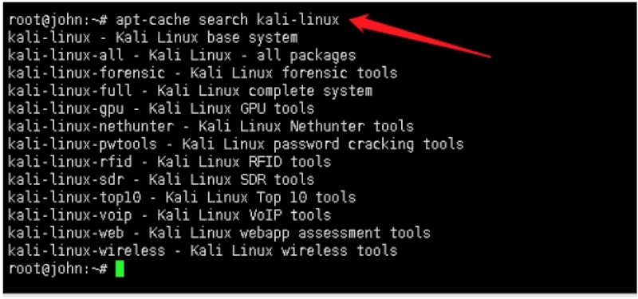


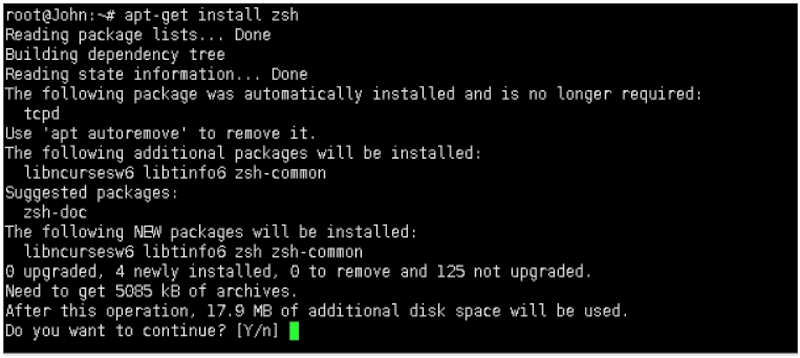

### 配置zsh：
```bash
sh -c "\$(curl -fsSL https://raw.githubusercontent.com/robbyrussell/oh-my-zsh/master/tools/install.sh)"
chsh -s `which zsh` //设置默认为zsh
cat /etc/shells //查看当前安装的shell
echo $SHELL //查看当前使用shells
```  
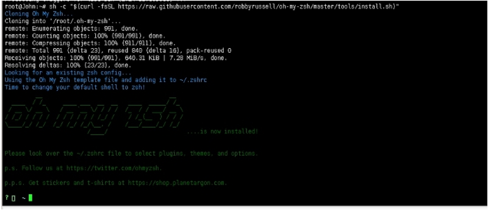

如果是 vps 不建议安装 oh-my-zsh，很多国外的 vps 延迟较多。我是配置zsh。

wget https://raw.githubusercontent.com/skywind3000/vim/master/etc/zshrc.zsh

把上面下载的文件复制粘贴到你的 ~/.zshrc 文件里，保存，运行 zsh 即可。头一次运行会安装一些依赖包，稍等两分钟，以后再进入就瞬间进入了。  


如果不能tab补全：
```bash
nano /root/.bashrc
```

跳到最后一行，添加：
```bash
if [ -f /etc/bash_completion ] && ! shopt -oq posix; then 
    ./etc/bash_completion
fi
```  
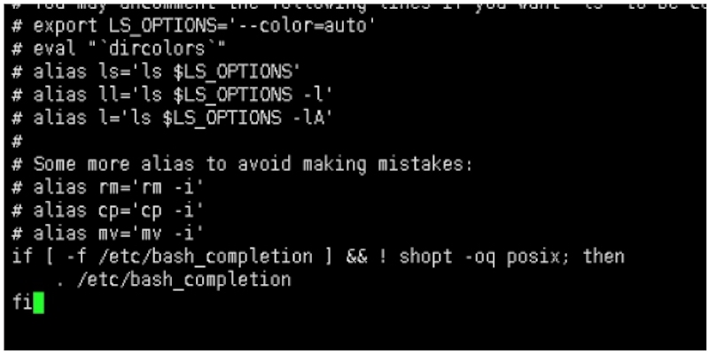

为msf payload添加第三方框架：（这未来会详细讲述，次季，仅是安装）
```bash
root@John:~# apt-get install veil-evasion
```
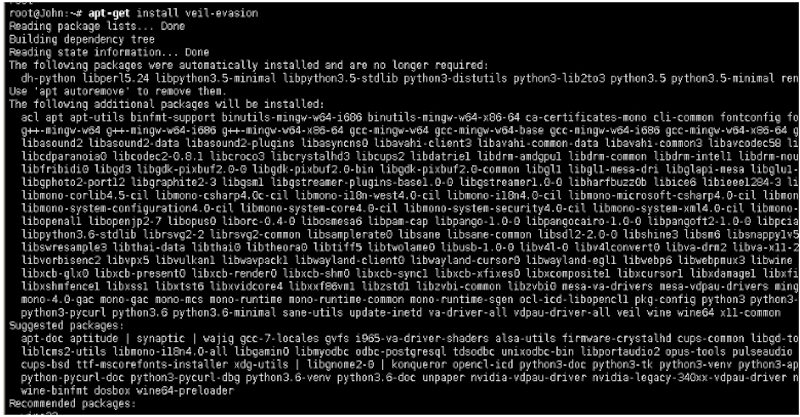  

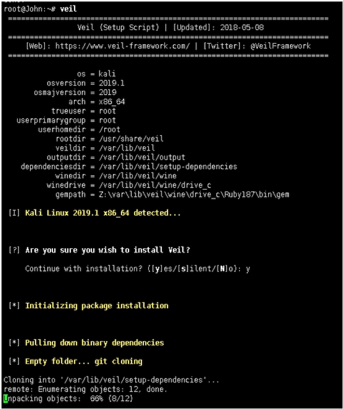  

至此vps上的msf的初级配置结束。

**注：部分vps上没有安装mlocate，安装即可。**

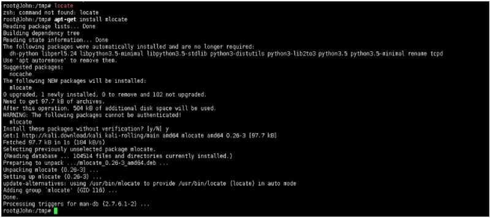

>   Micropoor
