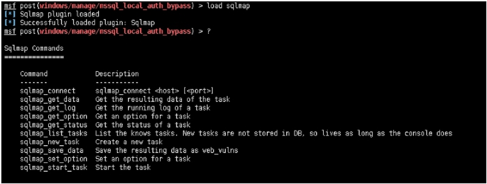
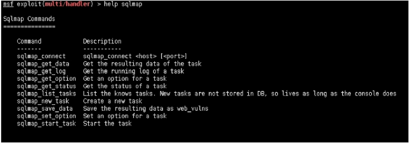
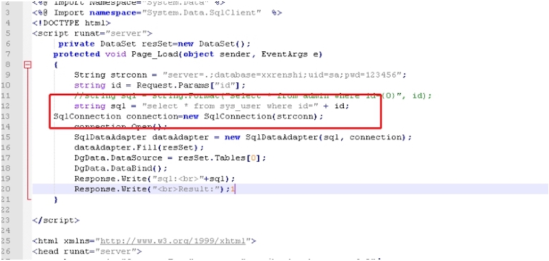
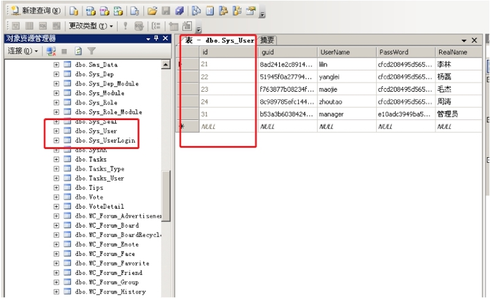
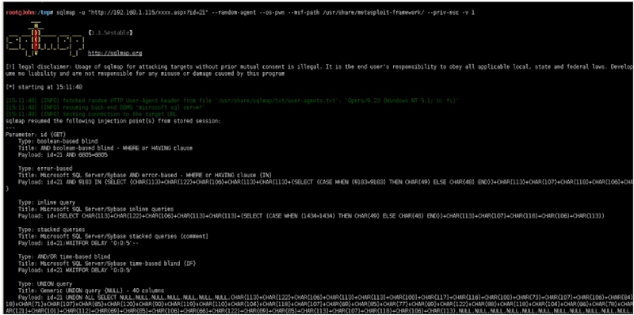

msf 在非 session 模式下与 session 模式下都支持第三方的加载与第三方框架的融合。代表参数为 load。两种模式下的 load 意义不同。本季主要针对非 session 模式下的 load sqlmap情景。  





### 加载Sqlmap后，主要参数如下：
```bash
Sqlmap Commands
=============== 

Command Description

‐‐‐‐‐‐‐ ‐‐‐‐‐‐‐‐‐‐‐
sqlmap_connect sqlmap_connect <host> [<port>]
sqlmap_get_data Get the resulting data of the task
sqlmap_get_log Get the running log of a task
sqlmap_get_option Get an option for a task
sqlmap_get_status Get the status of a task
sqlmap_list_tasks List the knows tasks. New tasks are not stored in DB,so lives as long as the console does
sqlmap_new_task Create a new task
sqlmap_save_data Save the resulting data as web_vulns
sqlmap_set_option Set an option for a task
sqlmap_start_task Start the task
msf exploit(multi/handler) > help sqlmap
```
help 加载的模块名，为显示第三方的帮助文档。  
  

msf 上的 sqlmap 插件依赖于 sqlmap 的 sqlmapapi.py 在使用前需要启动sqlmapapi.py  


然后在msf上建立任务。

而 sqlmap 对 msf 也完美支持。

**靶机：**  
192.168.1.115，Sql server 2005 + aspx.net

构造注入点，如图1：  

  

数据结构，如图2：  





关于msf与sqlmap的结合在未来的系列中还会继续讲述，本季作为基础。

### 附录：
注入点代码：
``` html
<%@ Page Language="C#" AutoEventWireup="true" %>
<%@ Import Namespace="System.Data" %>
<%@ Import namespace="System.Data.SqlClient" %>
<!DOCTYPE html>
<script runat="server">
private DataSet resSet=new DataSet();
protected void Page_Load(object sender, EventArgs e)
 {
String strconn = "server=.;database=xxrenshi;uid=sa;pwd=123456";
string id = Request.Params["id"];
//string sql = string.Format("select * from admin where id={0}", id);
string sql = "select * from sys_user where id=" + id;
SqlConnection connection=new SqlConnection(strconn);
connection.Open();
SqlDataAdapter dataAdapter = new SqlDataAdapter(sql, connection);
dataAdapter.Fill(resSet);
DgData.DataSource = resSet.Tables[0];
DgData.DataBind();
Response.Write("sql:<br>"+sql);
Response.Write("<br>Result:");
} 

 </script> 

<html xmlns="http://www.w3.org/1999/xhtml">
<head runat="server">
<meta http‐equiv="Content‐Type" content="text/html; charset=utf‐8"/>
<title></title>
</head>
<body>
<form id="form1" runat="server">
<div> 

<asp:DataGrid ID="DgData" runat="server" BackColor="White" BorderColor="#3366CC"
BorderStyle="None" BorderWidth="1px" CellPadding="4"
HeaderStyle‐CssClass="head" Width="203px">
<FooterStyle BackColor="#99CCCC" ForeColor="#003399" />
<SelectedItemStyle BackColor="#009999" Font‐Bold="True" ForeColor="#CCFF99" />
<PagerStyle BackColor="#99CCCC" ForeColor="#003399" HorizontalAlign="Left" Mode="NumericPages" />

<ItemStyle BackColor="White" ForeColor="#003399" />

<HeaderStyle CssClass="head" BackColor="#003399" Font‐Bold="True" Fore
Color="#CCCCFF"></HeaderStyle>
</asp:DataGrid> 

</div>
</form>
</body>
</html>
```

> Micropoor