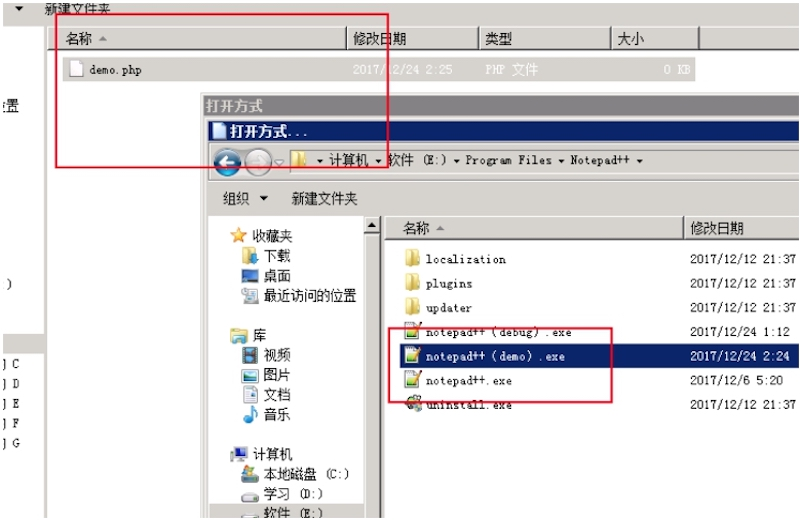
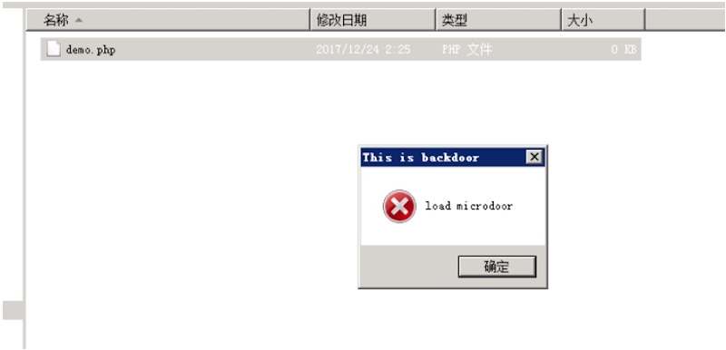
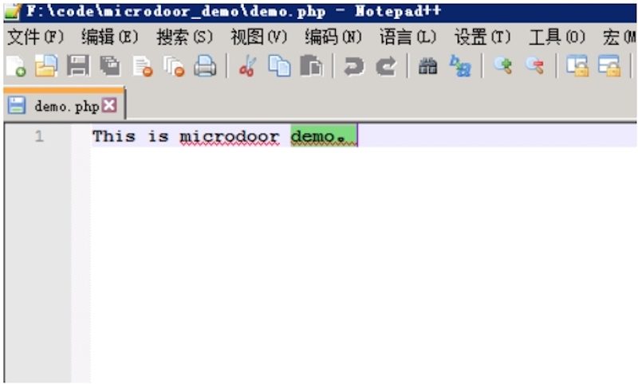
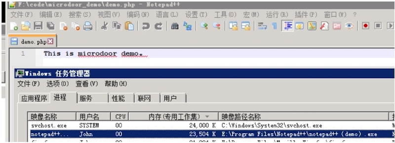
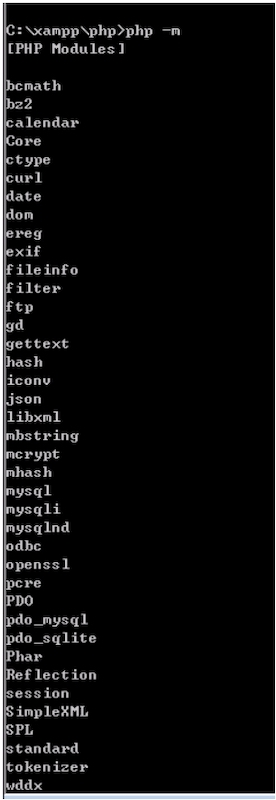
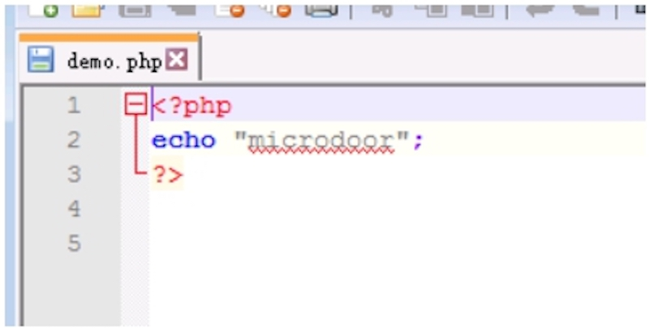
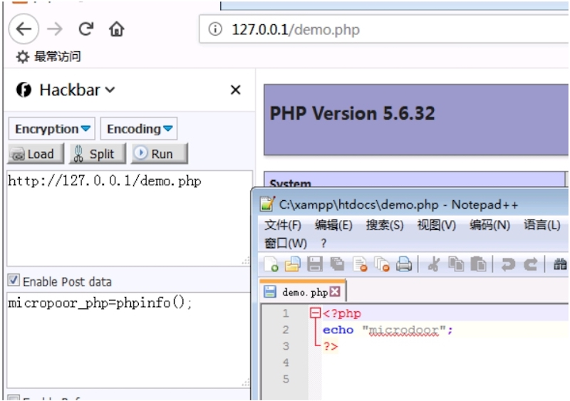

当我们接到某个项目的时候，它已经是被入侵了。甚至已经被脱库，或残留后门等持续攻击洗库。  

后渗透攻击者的本质是什么？
阻止防御者信息搜集，销毁行程记录，隐藏存留文件。  

防御者的本质是什么？
寻找遗留信息，发现攻击轨迹与样本残留并且阻断再次攻击。
那么这里攻击者就要引入“持续攻击”，防御者就要引入“溯源取证与清理遗留”，攻击与持续攻击的分水岭是就是后渗透持续攻击，而表现形式其中之一就是后门。

### 后门的种类：
* 本地后门：如系统后门，这里指的是装机后自带的某功能或者自带软件后门  
* 本地拓展后门：如iis 6的isapi，iis7的 模块后门  
* 第三方后门：如apache，serv-u，第三方软件后门  
* 第三方扩展后门：如php扩展后门，apache扩展后门，第三方扩展后门  
* 人为化后门：一般指被动后门，由人为引起触发导致激活，或者传播

**后门的隐蔽性排行：**本地后门 > 本地拓展后门 > 第三方后门 > 第三方扩展后门，这里排除人为化后门，一个优秀的人为化后门会造成的损失不可估计，比如勒索病毒的某些非联网的独立机器，也有被勒索中毒。在比如某微博的蠕虫等。

**整体概括分类为：**主动后门，被动后门。传播型后门。  

**后门的几点特性：**隐蔽，稳定。持久

一个优秀的后门，一定是具备几点特征的，无文件，无端口，无进程，无服务，无语言码，并且是量身目标制定且一般不具备通用性。

攻击者与防御者的本质对抗是什么？
增加对方在对抗中的时间成本，人力成本。

这里要引用百度对APT的解释：
> APT是指高级持续性威胁。利用先进的攻击手段对特定目标进行长期持续性网络攻击的攻击形式，APT攻击的原理相对于其他攻击形式更为高级和先进，其高级性主要体现在APT在发动攻击之前需要对攻击对象的业务流程和目标系统进行精确的收集。

那么关于高级持续渗透后门与上面的解释类似：高级持续渗透后门是指高级持续性后渗透权限长期把控，利用先进的后渗透手段对特定目标进行长期持续性维持权限的后攻击形式，高级持续渗透后门的原理相对于其他后门形式更为高级和先进，其高级性主要体现在持续渗透后门在发动持续性权限维持之前需要对攻击对象的业务流程和目标系统进行精确的收集并量身制定目标后门。

**第一季从攻击者角度来对抗：**  
项目中一定会接触到溯源，而溯源最重要的环节之一就是样本取证与分析。既然是样本取证，也就是主要找残留文件。可能是脚本，dll，so，exe等。其次是查找相关流量异常，端口，进程。异常日志。  
做为攻击者的对抗，无开放端口，无残留文件，无进程，无服务。在防御者处理完攻击事件后的一定时间内，再次激活。

这里要解释一下rootkit，它的英文翻译是一种特殊类型的恶意软件。百度百科是这样解释的：
> Rootkit是一种特殊的恶意软件，它的功能是在安装目标上隐藏自身及指定的文件、进程和网络链接等信息，比较多见到的是Rootkit一般都和木马、后门等其他恶意程序结合使用。Rootkit通过加载特殊的驱动，修改系
统内核，进而达到隐藏信息的目的。

在后门的进化中，rootkit也发生了变化，最大的改变是它的系统层次结构发生了变化。

### 后门的生成大体分4类：
1. 有目标源码  
2. 无目标源码  
3. 无目标源码，有目标api
4. 无目标源码，无api，得到相关漏洞等待触发

结合后门生成分类来举例细说几个demo。

## 1.有目标源码

目前大量服务器上有第三方软件。这里以notepad++为例。

Notepad++是Windows操作系统下的一套文本编辑器，有完整的中文化接口及支持多国语言编写的功能，并且免费开源。  

开源项目地址：https://github.com/notepad-plus-plus/notepad-plus-plus  

关于编译：https://micropoor.blogspot.hk/2017/12/1notepad.html

Demo 环境：windows 7 x64，notepad++(x64) Demo IDE：vs2017

在源码中，我们修改每次打开以php结尾的文件，先触发后门，在打开文件。其他文件跳过触发后门。

文件被正常打开。  

**优点：**在对抗反病毒，反后门软件中有**绝对优势**，可本地多次调试，稳定性强壮。跨平台能力非常强壮，并且可以对后门选择方式任意，如主动后门，被动后门，人为化后门等。  

**缺点：**针对性较强，需要深入了解目标服务器安装或使用软件。需要语言不确定的语言基础。在封闭系统，如Windows下多出现于第三方开源。

### 2.无目标源码

参考内部分享第九课

**优点：**在对抗反病毒，反后门软件中有**一定优势**，稳定性**良好**，跨平台能力一般，并且适用于大多数可操作文件，同样可以选择对后门选择方式任意，如主动后门，被动后门，人为化后门等。  

**缺点：**稳定性**不突出**，在修改已生成的二进制文件，容易被**反病毒**，**反后门**软件查杀。

### 3.无目标源码，有目标api

目前大多数的Ms_server，内置iis，从windows2000开始，而目前国内市场使用03sp2，08r2为主。在win下又以iis为主，在iis中目前主要分为iis5.x，iis6.x，大于等于iis7.x。iis7以后有了很大的变化，尤其引入模块化体系结构。iis6.x最明显的是内置IUSR来进行身份验证，IIS7中，每个身份验证机制都被隔离到自己的模块中，或安装或卸载。
同样，目前国内市场另一种常见组合XAMP（WIN+Apche+mysql+php，与Linux+Apche+mysql+php)，php5.x与php7.x有了很大的变化，PHP7将基于最初由Zend开发的PHPNG来改进其框架。并且加入新功能，如新运算符，标记，对十六进制的更友好支持等。

Demo 环境：windows 7x86 php5.6.32 
Demo IDE：vs2017
php默认有查看加载扩展，命令为php -m，有着部分的默认扩展，而在扩展中，又可以对自己不显示在扩展列表中

php.ini 配置  

以Demo.php为例，demo.php代码如下：

在访问demo.php，post带有触发后门特征，来执行攻击者的任意php代码。在demo中，仅仅是做到了，无明显的以php后缀为结尾的后门，那么结合第一条，有目标源码为前提，来写入其他默认自带扩展中，来达到更隐蔽的作用。

**优点：**在对抗反病毒，反后门软件中有**绝对优势**，可本地多次调试，稳定性**非常强壮**。跨平台能力非常强壮，且可以对后门选择方式任意，如主动后门，被动后门，人为化后门等。  

**缺点：**在编译后门的时候，需要查阅大量API，一个平台到多个平台的相关API。调试头弄，失眠，吃不下去饭。领导不理解，冷暖自知。

**第二季从防御者角度来对抗。**

>   后者的话：
目前国内市场的全流量日志分析，由于受制于存储条件等因素，大部分为全流量，流量部分分析。那么在高级持久性后门中，如何建立一个伪流量非实用数据来逃逸日志分析，这应该是一个优秀高级持续后门应该思考的问题。

>   Micropoor
