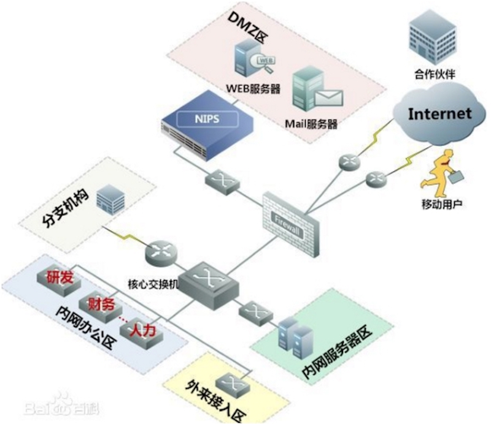
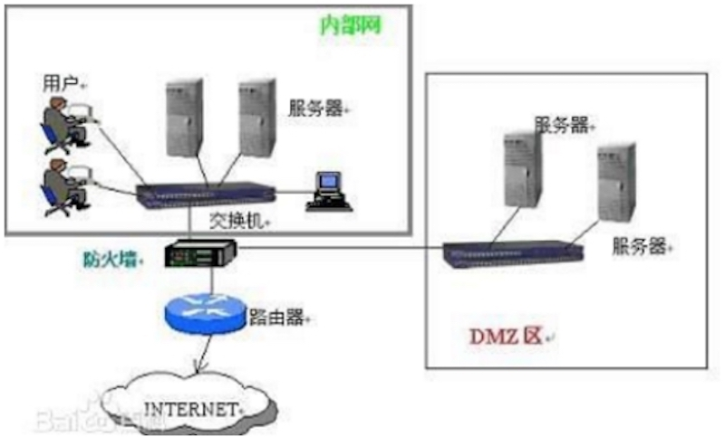

第四季是一个过渡季，过渡后门在对抗升级中由传统后门，衍生成锁定目标的制定后门。引用百度百科的“后门程序"的相关解释：  

https://baike.baidu.com/item/%E5%90%8E%E9%97%A8%E7%A8%8B%E5%BA%8F/108154  

安全从业人员，其实至少一直在与传统后门对抗，比如最常见的webshell免杀与webshell过waf。应急中的样本取证查杀远控残留文件等。但是webshell，远控仅仅又是“backdoor”的其中一种。

这里按照上几季的风格继续引用几个概念，只有概念清晰，才能了解如何对抗。

1：安全从业人员为什么要了解后门？
防御是以市场为核心的，而不是以项目为核心。需要对抗的可能是黑产从业者的流量劫持相关
后门，或者是政治黑客的高持续渗透权限把控后门等。

2：攻击人员为什么要了解后门？
随着对抗传统后门的产品越来越成熟，由特征查杀，到行为查杀，到态势感知。到大数据联合特征溯源锁定，如何反追踪，是一个非常值得思考的问题。

3：后门与项目的关联是什么？
某项目，被入侵，应急并加固解决，若干天后，再次被入侵依然篡改为某博彩。导致安全从业人员，客户之间的问题。

4：后门与安全产品的关联是什么？
某客户购买某安全产品套装，在实战中，一般由非重点关注服务器迂回渗透到核心服务器来跨过安全产品监控，得到相关权限后，后门起到越过安全产品。它会涉及对其他附属安全产品的影响。如客户质疑：为什么我都买了你们的套装，还被入侵。并且这还是第二次了。

思维跳出以上4条，来看下进一年的部分相关安全事件：  

  

思维跳出以上4条安全事件，这里再一次引入百度百科的APT的主要特性：

**——潜伏性：**这些新型的攻击和威胁可能在用户环境中存在一年以上或更久，他们不断收集各种信息，直到收集到重要情报。而这些发动APT攻击的黑客目的往往不是为了在短时间内获利，而是把“被控主机”当成跳板，持续搜索，直到能彻底掌握所针对的目标人、事、物，所以这种APT攻击模式,实质上是一种“恶意商业间谍威胁”。

**——持续性：**由于APT攻击具有持续性甚至长达数年的特征，这让企业的管理人员无从察觉。在此期间，这种“持续性”体现在攻击者不断尝试的各种攻击手段，以及渗透到网络内部后长期蛰伏。

**——锁定特定目标：**针对特定政府或企业，长期进行有计划性、组织性的窃取情报行为,针对被锁定对象寄送几可乱真的社交工程恶意邮件，如冒充客户的来信,取得在计算机植入恶意软件的第一个机会。

**——安装远程控制工具：**攻击者建立一个类似僵尸网络Botnet的远程控制架构，攻击者会定期传送有潜在价值文件的副本给命令和控制服务器(C&C Server)审查。将过滤后的敏感机密数据，利用加密的方式外传。

一次针对特定对象，长期、有计划性渗透的本质是什么？窃取数据下载到本地，或者以此次渗透来达到变现目的。引用如图：

一次具有针对性的渗透，绝对不单单是以渗透DMZ区为主，重要资料一般在内网服务器区（包括但不限制于数据库服务器，文件服务器，OA服务器），与内网办公区（包括但不限制于个人机，开发机，财务区）等。而往往这样的高级持续渗透，不能是一气呵成，需要一定时间内，来渗透到资料所在区域。而这里其中一个重要的环节就是对后门的要求，在渗透期间内（包括但不限制于一周到月甚至到年）以保持后续渗透。
传统型的后门不在满足攻击者的需求，而传统型的木马后门，大致可分为六代：

第一代，是最原始的木马程序。主要是简单的密码窃取，通过电子邮件发送信息等，具备了木马最基本的功能。

第二代，在技术上有了很大的进步，冰河是中国木马的典型代表之一。

第三代，主要改进在数据传递技术方面，出现了ICMP等类型的木马，利用畸形报文传递数据，增加了杀毒软件查杀识别的难度。

第四代，在进程隐藏方面有了很大改动，采用了内核插入式的嵌入方式，利用远程插入线程技术，嵌入DLL线程。或者挂接PSAPI，实现木马程序的隐藏，甚至在Windows NT/2000下，都达到了良好的隐藏效果。灰鸽子和蜜蜂大盗是比较出名的DLL木马。

第五代，驱动级木马。驱动级木马多数都使用了大量的Rootkit技术来达到在深度隐藏的效果，并深入到内核空间的，感染后针对杀毒软件和网络防火墙进行攻击，可将系统SSDT初始化，导致杀毒防火墙失去效应。有的驱动级木马可驻留BIOS，并且很难查杀。

第六代，随着身份认证UsbKey和杀毒软件主动防御的兴起，黏虫技术类型和特殊反显技术类型木马逐渐开始系统化。前者主要以盗取和篡改用户敏感信息为主，后者以动态口令和硬证书攻击为主。PassCopy和暗黑蜘蛛侠是这类木马的代表。

以远控举例，远控最开始生成的RAT功能一体化（包括但不限制于文件传输，命令执行等），后衍生成生成RAT支持插件式来达到最终目的。

以上的几代包括以上远控共同点，以独立服务或者独立进程，独立端口等来到达目的。难以对抗目前的反病毒反后门程序。那么传统型后门权限维持就不能满足目前的需求。

以第二季的demo举例，它无自己的进程，端口，服务，而是借助notepad++（非dll劫持）来生成php内存shell（这个过程相当于插件生成），并且无自启，当服务器重启后，继续等待管理员使用notepad++，它属于一个AB链后门，由A-notepad生成B-shell，以B-shell去完成其他工作。如果继续改进Demo，改造ABC链后门，A负责生成，B负责清理痕迹，C负责工作呢?这是一个攻击者应该思考的问题。

而后门的主要工作有2点，1越过安全产品。2维持持续渗透权限。
文章的结尾，这不是一个notepad++的后门介绍，它是一个demo，一个类后门，一个具有源码可控类的后门。

>   Micropoor
