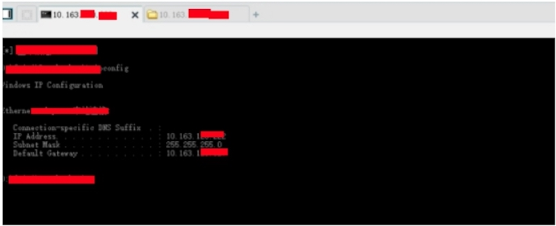
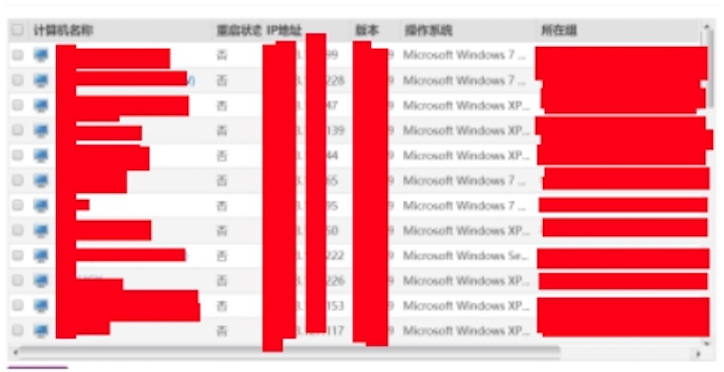
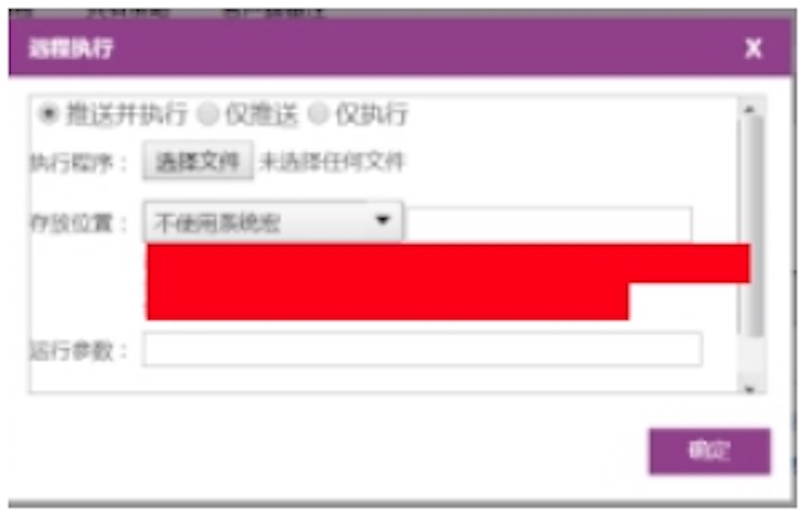
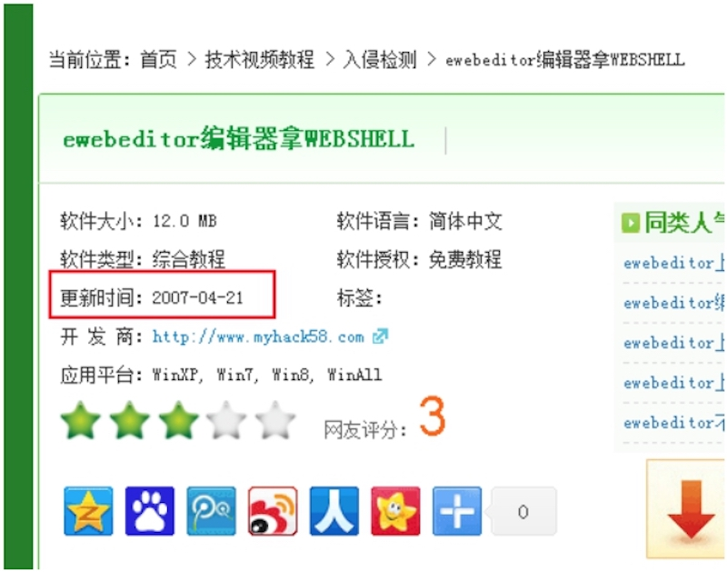
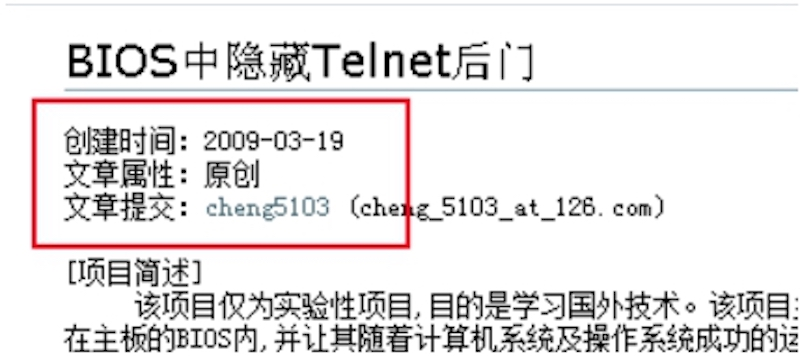
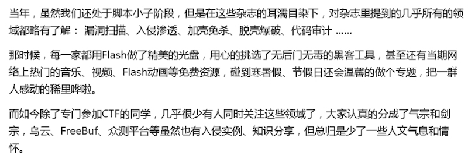

专注APT攻击与防御
https://micropoor.blogspot.com/

这一季依然是一个过渡季，根据之前的连载中，了解到后门是渗透测试的分水岭，它分别体现了攻击者对目标机器的熟知程度，环境，编程语言，了解对方客户，以及安全公司的本质概念。也同样检测了防御者需要掌握后门的基本查杀，与高难度查杀，了解被入侵环境，目标机器。以及后门或者病毒可隐藏角落，或样本取证，内存取证等。.对各种平台查杀熟知，对常见第三方软件的了解程度。既然题目以“艺术”为核心，那么怎样把后门“艺术”行为化呢？

依然遵循以往，引入概念，**只有概念清晰，本质清晰，对于攻击者，这样的后门更具有持久性，潜伏性，锁定性等。对于防御者，更能熟知反后门对抗，对待常用第三方软件的检测方式方法，切断攻击者的后渗透攻击。溯源或取证攻击者。**

在高级持续渗透测试中，PTES的渗透测试执行标准主要分为**6段1报**。既：
* 1.前期交互阶段
* 2.情报收集阶段
* 3.威胁建模阶段
* 4.漏洞分析阶段
* 5.渗透攻击阶段
* 6.后渗透攻击阶段
* 7.报告编写

这里要讲的不是打破它的流程，而是归纳总结到类，明确了类的方向，对待一个未知的目标网络环境，更能清晰的进行攻击或者对抗。

**提权的本质是什么？**
**信息搜集，**搜集目标补丁情况，了解目标第三方利用等。

**内网渗透的本质是什么？**
**信息搜集，**搜集目标内网的组织架构，明确渗透诉求，在渗透过程中，当获取到内网组织架构图，如鱼得水。

**渗透与高级持续渗透的本质区别是什么？**
区别于“持续”，可长期根据攻击者的诉求来潜伏持久的，具有针对性的**信息获取**。

（而在高级持续渗透它又分为2类，一类持久渗透，一类即时目标渗透）

**溯源取证与对抗溯源取证的本质是什么？**
**信息搜集**与**对抗信息搜集**。

以上4条，清晰的明确了类，以及类方向，在一次完整的实战过程中，攻击者与防御者是需要角色对换的，前期，攻击者信息搜集，防御者对抗信息搜集。而后渗透，攻击者对抗信息搜集，防御者信息搜集。

而在两者后的持续把控权限，是随机并且无规律的角色对换过程。主要表现之一为后门。这一句话也许很难理解，举例：

持续把控权限过程中，攻击者需要对抗防御者的信息搜集，而又要根据对方行为制定了解防御者的相关动作以及熟知目标环境的信息搜集安全时间。（包括但不限制于如防御者近期对抗查杀动作，防御者的作息规律，目标环境的作息规律等来制定相关计划）。

而在持续把控权限的过程中，防御者需要定期不完全依赖安全产品对自身环境的信息进行搜集（包括但不限制于日志异常，登陆异常，数据异常，第三方篡改日常等），一旦发现被攻击或者异常，对抗攻击者搜集，并且搜集攻击信息，攻击残留文件，排查可能沦陷的内网群，文件等。

在一次的引用百度百科对APT的解释：APT是黑客以窃取核心资料为目的，针对客户所发动的网络攻击和侵袭行为，是一种蓄谋已久的“恶意商业间谍威胁”。这种行为往往经过长期的经营与策划，并具备高度的隐蔽性。APT的攻击手法，在于隐匿自己，针对特定对象，长期、有计划性和组织性地窃取数据，这种发生在数字空间的偷窃资料、搜集情报的行为，就是一种“网络间谍”的行为。

实战中的APT又主要分为2大类，一类**持久渗透**，一类**即时目标渗透**，主要区别于高级持续渗透是6段1报，即时目标渗透是5段1清1报，共同点都是以黑客以窃取核心资料为目的，并且是一种蓄谋已久的长期踩点针对目标监视（包括但不限制于服务更新，端口更新，web程序更新，服务器更新等）。不同点主要区别于即时目标渗透清晰目标网络构架或是明确诉求，得到目标诉求文件，随即销毁自身入侵轨迹。结束任务。而**即时目标渗透**往往**伴随**着**传统的人力情报**的配合进行网络行动。

在即时目标渗透测试中，主要分为**5段1清1报**。既：

1. 前期交互阶段
2. 情报收集阶段
3. 威胁建模阶段
4. 漏洞分析阶段
5. 渗透攻击阶段
6. 清理攻击痕迹
7. 报告编写

持久渗透以时间换空间为核心的渗透，以最小化被发现，长期把控权限为主的渗透测试。

即时目标渗透则相反，放大已知条件，关联已知线索，来快速入侵，以达到诉求。

为了更好的解释APT即时目标渗透，举例某实战作为demo（由于是为了更好的解释即时目标渗透，所以过程略过），大部分图打码，见谅。

**任务背景：**
**任务诉求：**需要得知周某某的今年采购的其中一个项目具体信息。
**已知条件：**该成员是xxx某大型公司。负责XXXX的采购人员。配合人力得知姓名，电话，身份证，照片等。
**任务时间：**一周之内
**制定计划：**找到开发公司，获取源码，代码审计，得到shell，拿到服务器，得到域控（或者终端管理）。得到个人机。下载任务文件。
**任务过程：**得知该XXX公司xxxx网站是某公司出品，得到某公司对外宣传网站，并且得到该开发公司服务器权限，下载源码模板。

**源码审计过程略过**。得到webshell

**提权略过**。得到服务器权限。

**内网渗透略过**，配合人力情报，大致清楚目标内网架构。直奔内网终端管理系统。

查看在线机器，查找目标人物。

任务推送执行：

目标回链：

目标桌面截图：确定为目标人物

下载任务文件后，清理入侵痕迹。任务完成。

 
那么持久渗透，即时目标渗透的主要表现区别即为后持续渗透，无后门的安装，无再次连接目标。以及传统人力情报的配合。

那么在demo中，如果需要长期跟踪，并且对方的内网中有多款安全产品，那么就要为它来制定一款针对该目标的后门。在传统后门中，大多数只考虑目标机系统环境，那么题目为“后门”的艺术，在今天强大的安全产品中对抗升级中，后门也开始加入了人性化因素。以及传统后门的特性变更：如无进程，无服务，无端口，无自启，无文件等，来附属在第三方上。根据目标环境的人为特点，上线时间，操作时间。来制定一次后门的唤醒时间。需要了解目标经常使用的第三方软件，来制定后门类型。（参考第一季）。

如何把后门定制到更贴近目标，来对抗反病毒，反后门查杀。利用人为化来启动，或者第三方唤醒，这应该是值得攻击者思考的问题。

而明确了类与类的方向，如何阻断攻击者的信息搜集，并且加大攻击者的暴露踪迹，减少非必要的第三方，这应该是指的防御者思考的问题。

后门在对抗升级中，越贴近目标的后门越隐蔽，越贴近人性化的后门越持久，而由于目前存储条件等因素，还不能够全流量的全部记录，而是全流量的部分流量记录。导致不能完全依赖安全产品，并且在实战中，往往并不是每一台机器（包括但不限制于服务器，个人机，办公及）都遵循安全标准。尤其是在当今VPN办公普遍的情况下，家用个人机为突破点的例子层出不穷。其他非人为因素等。导致了当下的安全再次回归到安全的初衷：人。是的，人是安全的尺度。

**/\*段子\*/**

可能某老夫跳出来，大喊，后门的人性化制作就这一个也能算艺术？
在现实中，我很喜欢问别人三个问题：
1. 你用过最糟糕的后门是什么样的？
2. 你用过最精彩的后门是什么样的？
3. 你最理想的后门是什么样的？

问题1.能大致分析出对方的入行时间
问题2.能大致的判断出对方目前的技术水平
问题3.能直接判断出对方对技术的追求是怎样的心态
后门是一种艺术。

在文章的结尾处，我想贴几个图。
**当初：多么简单的知识，都会找到你想要的教程。多么复杂的知识都会找到相关的文章。**

**现在：想学习的人，找不到入门的知识，与可以建立兴趣的文章。想分享的人却又胆战心惊。**

**来自知乎某大V的回忆当初：**

黑吧的logo还是曾经的那个logo，联盟的国徽还是那个国徽，只是人的心变了。

附录：
PTES中文版
http://netsec.ccert.edu.cn/hacking/files/2011/07/PTES_MindMap_CN1.pdf

>   Micropoor
